# AgentDesk

> **複数のAIエージェントを同時に実行・監視・制御する開発者向けOS**

AgentDeskは、macOSデスクトップのメタファーをAIエージェントのオーケストレーションに適用したプロジェクト運用システムです。
メニューバー、デスクトップアイコン、ドラッグ可能なウィジェット、Dock、フローティングアプリウィンドウを備えたダークターミナルインターフェースです。

> 🌐 [English README](README.md) · [한국어](README_ko.md) · [中文](README_zh.md)

---

## 🎬 プロジェクト紹介資料

| 形式 | ファイル | 説明 |
|------|------|------|
| 🎥 動画 | [`docs/reports/AgentDesk-Introduction.mp4`](docs/reports/AgentDesk-Introduction.mp4) | 96秒の紹介動画 (1920×1080, H.264) — Remotionでレンダリングした10シーン |
| 📊 プレゼン | [`docs/reports/AgentDesk-Introduction.pptx`](docs/reports/AgentDesk-Introduction.pptx) | 10スライドのPowerPointデッキ — アーキテクチャ・機能・開発状況 |
| 🌐 HTMLスライド | [`docs/reports/AgentDesk-Introduction.html`](docs/reports/AgentDesk-Introduction.html) | インタラクティブスライド (KO/EN切替) — ブラウザで直接開く |

---

## スクリーンショット

<table>
  <tr>
    <td>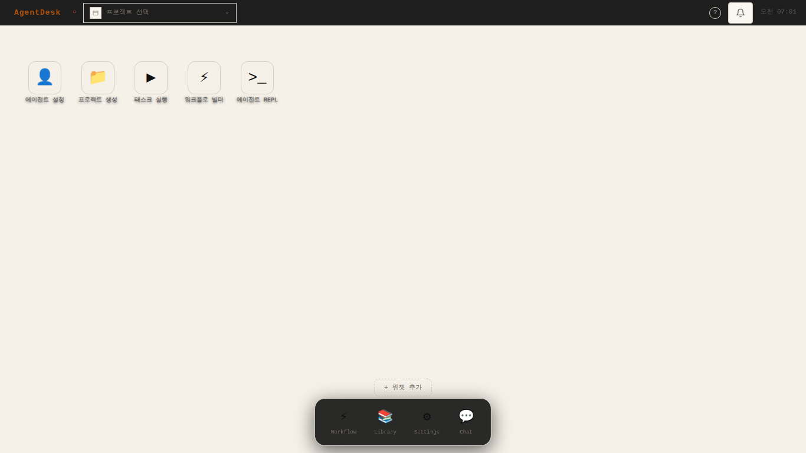<br/><sub>デスクトップ</sub></td>
    <td>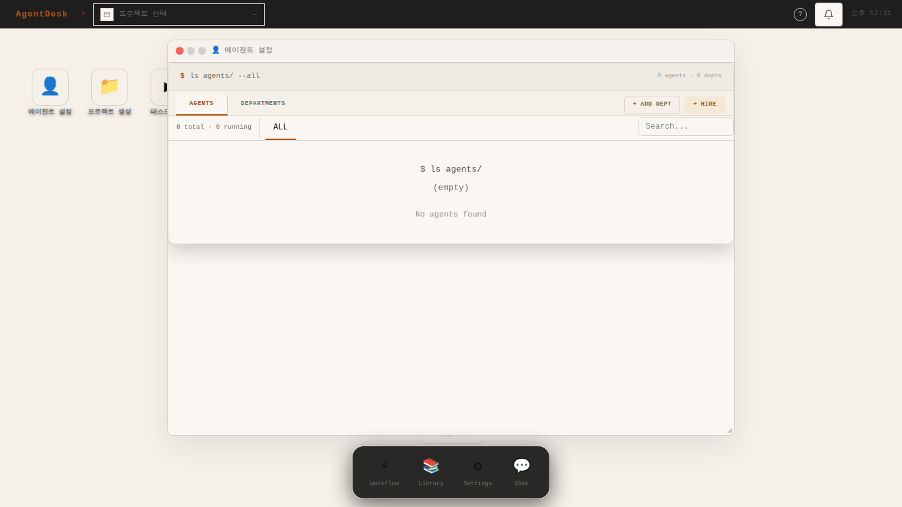<br/><sub>エージェントマネージャー</sub></td>
  </tr>
  <tr>
    <td>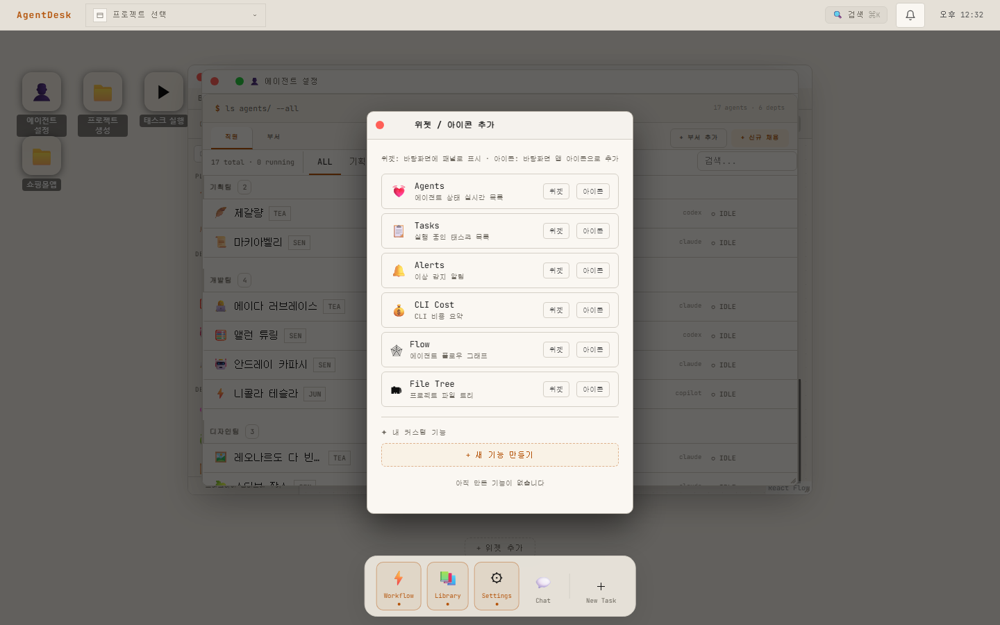<br/><sub>エージェント採用</sub></td>
    <td><br/><sub>部署追加</sub></td>
  </tr>
  <tr>
    <td>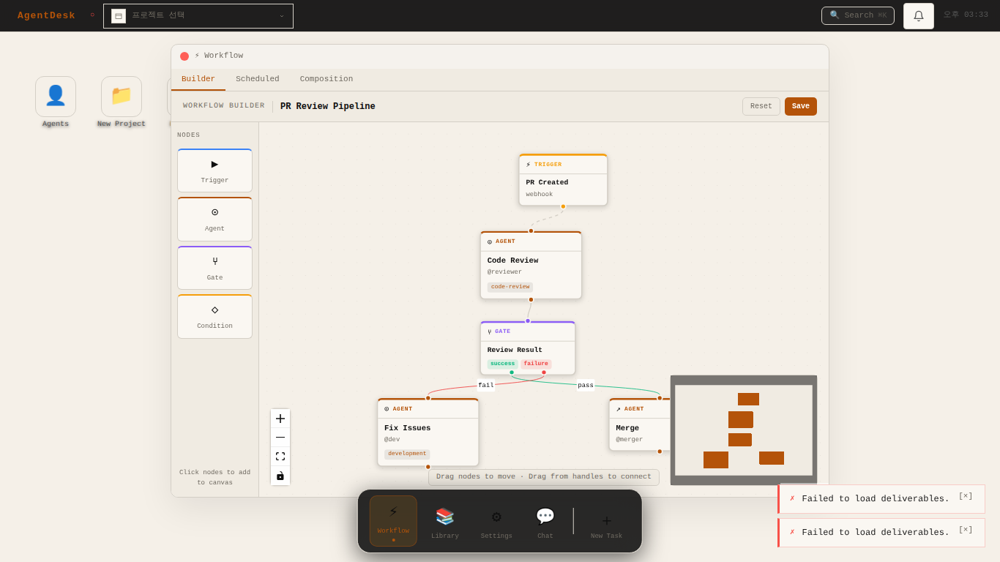<br/><sub>ワークフロービルダー</sub></td>
    <td>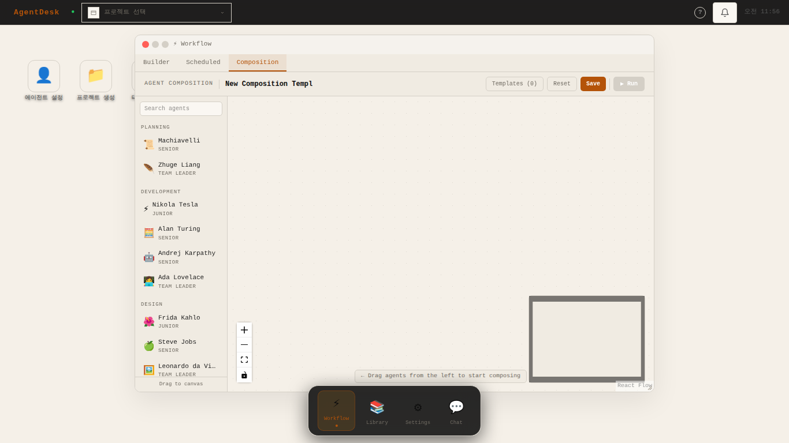<br/><sub>エージェントコンポジション</sub></td>
  </tr>
  <tr>
    <td>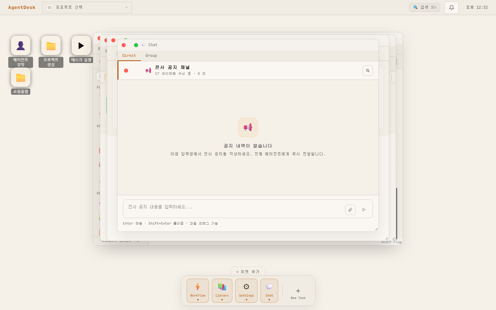<br/><sub>ダイレクトチャット</sub></td>
    <td>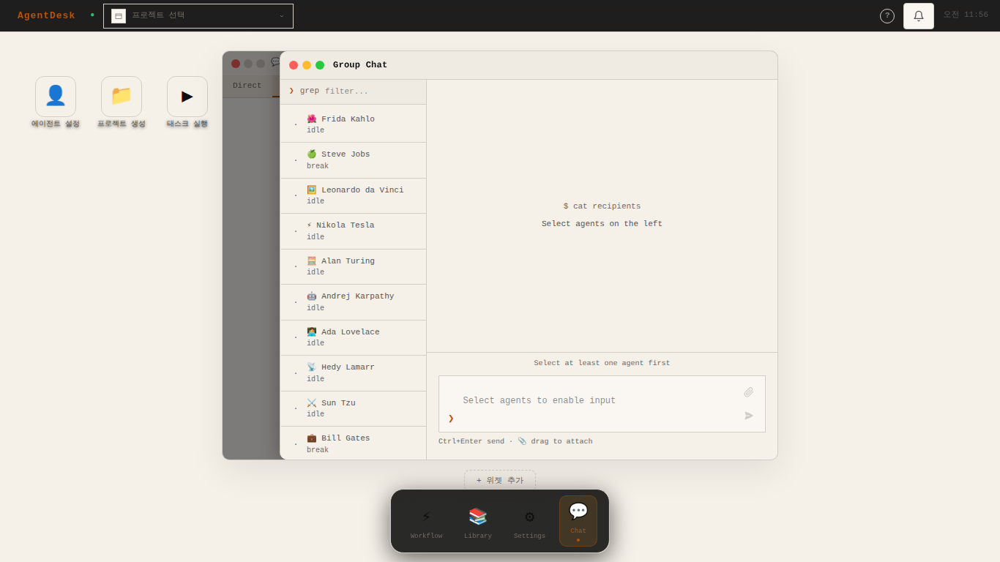<br/><sub>グループ放送チャット</sub></td>
  </tr>
  <tr>
    <td>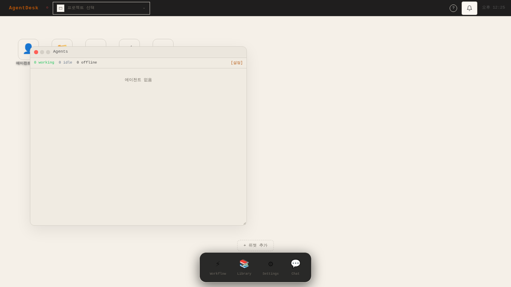<br/><sub>エージェントウィジェット</sub></td>
    <td><br/><sub>アラートウィジェット</sub></td>
  </tr>
  <tr>
    <td>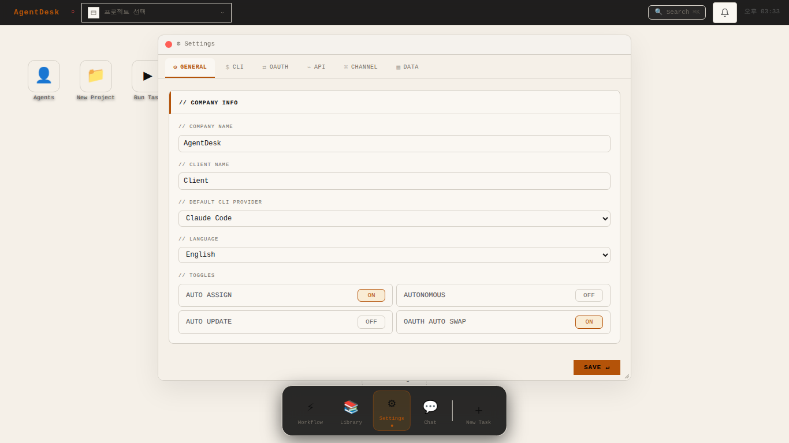<br/><sub>設定</sub></td>
    <td>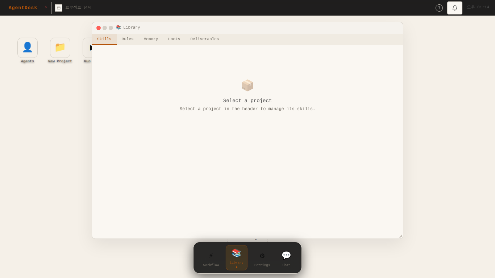<br/><sub>ライブラリ — Skills</sub></td>
  </tr>
  <tr>
    <td>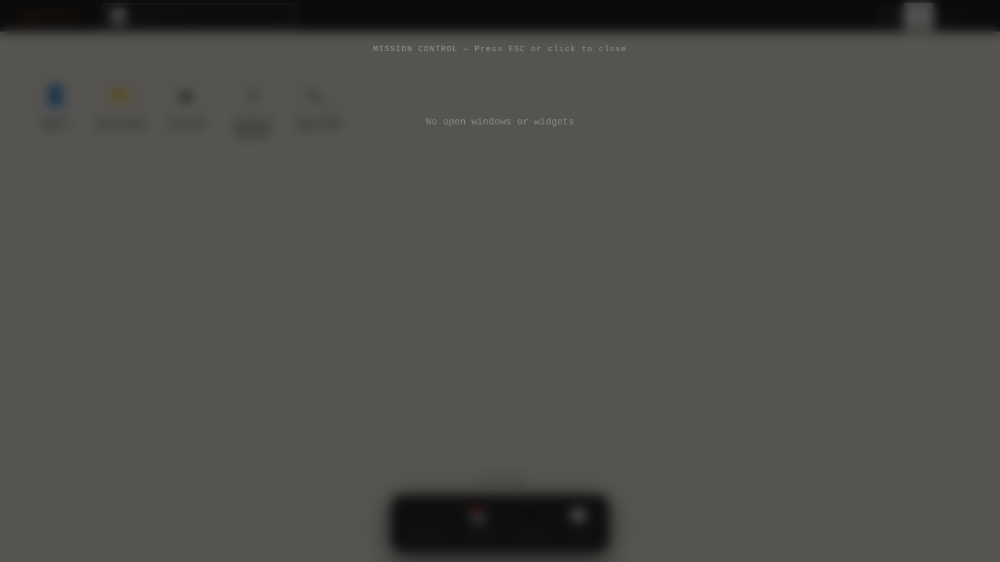<br/><sub>ミッションコントロール (Ctrl+↑)</sub></td>
    <td>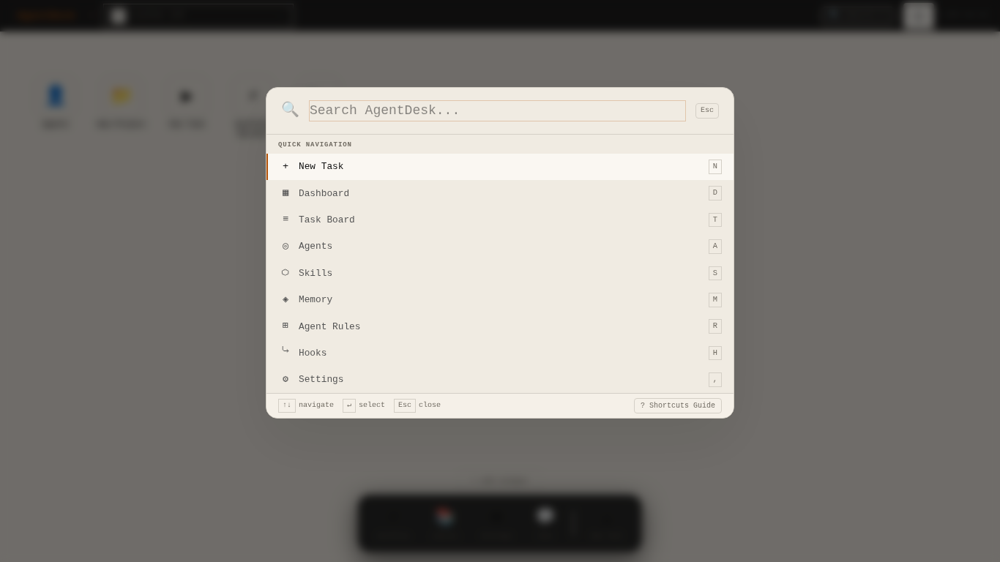<br/><sub>コマンドパレット (Ctrl+Shift+K)</sub></td>
  </tr>
</table>

---

## AgentDeskとは？

AgentDeskはAIエージェントチームのための**プロジェクト運用システム**です。ローカルWebアプリとして動作し、以下を実現します：

- **AIエージェントの作成・管理** — ペルソナ、役割、部署、CLIプロバイダー、APIモデルの設定
- **ワークフローのオーケストレーション** — ビジュアルビルダー、スケジュールタスク、マルチエージェントコンポジションパイプライン
- **リアルタイム監視** — ハートビートウィジェット、タスクボード、アラートフィード、フローグラフ、CLIコスト追跡
- **エージェントとのチャット** — ダイレクトメッセージ、グループ放送、Telegram/Discord/Slackゲートウェイ
- **共有ナレッジベース** — Skills、Rules、Memory、Hooks、Deliverables、Templatesライブラリ
- **分析・エクスポート** — エージェントパフォーマンスダッシュボード、CSV/JSONデータエクスポート、コスト分析
- **すべてをコントロール** — macOSスタイルデスクトップ（Spotlight検索、ミッションコントロール、クイックルック）

---

## 主な機能

### 🖥️ macOSスタイルデスクトップOS
- メニューバー + デスクトップアイコン + Dock + フローティングウィンドウ
- ドラッグ&ドロップのアイコン配置 + Jiggleモード（600msロングプレス）
- クイックルック（Space）— プロジェクトのクイックプレビュー
- ミッションコントロール（Ctrl+↑）— すべてのウィンドウ・ウィジェットの概要
- Spotlightスタイルのコマンドパレット（Ctrl+Shift+K）
- 10種類のグラデーション壁紙テーマ

### 👤 エージェント・部署管理
- カスタムアバター、ペルソナ、役職レベル（チームリーダー/シニア/ジュニア/インターン）でエージェントを採用
- 共有システムプロンプトを持つ部署単位の組織構成
- CLIプロバイダー（Claude、OpenAI、Geminiなど）またはAPIモデルの割り当て
- リアルタイムハートビート監視

### ⚡ ワークフロー自動化
- ビジュアルドラッグ&ドロップワークフロービルダー + ノード編集パネル
- **Cronスケジューラー** — ワークフロー別スケジュール設定（⏰ボタン、6種プリセット）
- カスタムノードタイプのマルチエージェントコンポジションパイプライン
- 7種類の内蔵ワークフローパック（開発、リサーチ、小説、レポート、映像、ロールプレイ、アセット管理）
- 自動保存 + 変更フラグ + 破棄前確認

### 🧩 カスタムウィジェットプラットフォーム
- **ウィジェットビルダー** — 7種類の内蔵テンプレートからカスタムダッシュボードウィジェットを作成
- **AI生成** — 自然言語でウィジェットを説明すると、esbuild + サンドボックスiframeでTSXウィジェットを自動生成
- パラメータタイプ: テキスト、数値、トグル、セレクト、エージェントピッカー
- カスタムウィジェットの保存・管理・Dock追加

### 💬 マルチエージェントチャット
- 個別エージェントへのダイレクトメッセージ
- 全エージェントへのグループ放送チャンネル
- Telegram / Discord / Slackゲートウェイ連携
- メッセンジャー `$` ディレクティブ・`!` タスクフロー

### 📚 ナレッジライブラリ
- **Skills** — 再利用可能なタスクテンプレート
- **Rules** — エージェントの行動ルール・ガイドライン（Global/Project/Agent/Dept スコープ）
- **Memory** — 永続的なエージェントコンテキスト
- **Hooks** — イベント駆動の自動化スクリプト
- **Deliverables** — 成果物アーティファクトの追跡（検索・ソート・アップロード）
- **Templates** — プロジェクトテンプレート（4種類内蔵 + カスタム）+ タスクテンプレートライブラリ
- **Performance** — エージェント別成功率、平均完了時間、トレンドスパークライン

### 📊 分析・エクスポート
- **エージェントパフォーマンスダッシュボード** — 成功率バッジ、ステータススタックバー、日別スパークライン；プロジェクト/期間フィルター、ソート
- **データエクスポート** — タスク/成果物/エージェント/コスト → CSV（UTF-8 BOM、Excel対応）またはJSON；プロジェクト・ステータス・日付フィルター；「AgentDesk」メニューからワンクリック
- **プロジェクトコストサマリー** — 総コスト、今月分、エージェント別・ワークフロー別内訳

### 🗂 プロジェクトダッシュボード
- 円形SVG進捗インジケーター + ステータス（アクティブ/完了/キャンセル）付き目標管理
- レビューゲート：ステータス（保留/進行中/合格/失敗）+ 基準 + 期日
- インライン作成/編集/削除
- 事前入力された目標・ゲートを含むプロジェクトテンプレート

### 🔔 通知センター
- 320px右スライドパネル（macOSトラフィックライトボタン）
- 日付グループ（今日/昨日/それ以前）+ セクション別未読カウント
- ホバークイックアクション：既読 ✓ + 個別削除
- タイプ別フィルター（完了/エラー/決定/アラート/情報）+ 未読バッジ
- 読み済み通知の一括削除

### 📊 リアルタイムダッシュボードウィジェット

| ウィジェット | 説明 |
|------------|------|
| 💓 エージェント | エージェント状態のリアルタイム一覧 (working / idle / offline) |
| 📋 タスク | アクティブタスクボード |
| 🔔 アラート | 異常検知・エラー通知 |
| 💰 CLIコスト | トークン使用量・レート制限の追跡 |
| 🔀 フローグラフ | エージェント通信フローグラフ |
| 🗂 ファイルツリー | プロジェクトディレクトリブラウザー |
| 🧩 カスタム | AI生成またはテンプレートベースのカスタムウィジェット |

---

## 🌍 多言語対応

言語設定に応じてすべてのUIテキストが自動的に切り替わります — **한국어 · English · 日本語 · 中文**

### アプリメニュー

<table>
  <tr>
    <th>🇰🇷 한국어</th>
    <th>🇺🇸 English</th>
    <th>🇯🇵 日本語</th>
    <th>🇨🇳 中文</th>
  </tr>
  <tr>
    <td>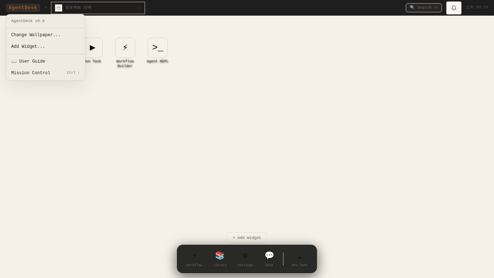</td>
    <td></td>
    <td></td>
    <td></td>
  </tr>
</table>

### ミッションコントロール

<table>
  <tr>
    <th>🇰🇷 한국어</th>
    <th>🇺🇸 English</th>
    <th>🇯🇵 日本語</th>
    <th>🇨🇳 中文</th>
  </tr>
  <tr>
    <td></td>
    <td></td>
    <td></td>
    <td></td>
  </tr>
</table>

---

## 技術スタック

| レイヤー | 技術 |
|---------|------|
| フロントエンド | React 19 + TypeScript + Vite + Tailwind CSS |
| 状態管理 | Zustand |
| フロー図 | `@xyflow/react` v12 |
| バックエンド | Node.js + Express + tsx |
| データベース | SQLite (`better-sqlite3`) + バージョン管理マイグレーション |
| リアルタイム | WebSocket |
| ロギング | pino |
| テスト | Vitest (ユニット + 統合) + Playwright (E2E) |
| パッケージマネージャー | pnpm |
| デスクトップアプリ | Electron (オプション) |

---

## クイックスタート

**必要環境:** Node.js ≥ 22, pnpm ≥ 10

```bash
git clone <repo-url> && cd AgentDesk
pnpm install
cp .env.example .env      # 環境変数の設定 (SESSION_SECRET 必須)
pnpm setup                # DB初期化 + マイグレーション
pnpm dev                  # フロントエンド(8800) + APIサーバー(8790)
```

ブラウザで **http://localhost:8800** にアクセス

### 最初のエージェント登録フロー

```
1. Settings → API → APIプロバイダーを追加 (Claude / OpenAI / Gemini)
2. エージェントマネージャー → 部署追加 → エージェント採用
3. デスクトップ → 📁 プロジェクト作成 → エージェントを割り当て
4. ライブラリ → Rules / Memory / Hooks を設定 (オプション)
5. デスクトップ → ▶ タスク実行 → ターミナルパネルでリアルタイム監視
```

### キーボードショートカット

| ショートカット | 動作 |
|--------------|------|
| `Ctrl+Shift+K` / `Cmd+K` | コマンドパレット |
| `Ctrl+↑` | ミッションコントロール |
| `g w` | ワークフローウィンドウのトグル |
| `g l` | ライブラリウィンドウのトグル |
| `g s` | 設定ウィンドウのトグル |
| `g c` | チャットウィンドウのトグル |
| `g a` | エージェントマネージャーのトグル |
| `g e` | REPLのトグル |
| `Space` | クイックルック（アイコン選択後） |
| `?` | キーボードショートカットガイド |

---

## ドキュメント

| ドキュメント | 内容 |
|------------|------|
| [`docs/OVERVIEW.md`](docs/OVERVIEW.md) | アーキテクチャ概要 + 完成機能一覧 |
| [`docs/architecture/AGENT-CONFIGURATION-AND-EXECUTION.md`](docs/architecture/AGENT-CONFIGURATION-AND-EXECUTION.md) | エージェント設定・実行（DB・分岐・現行実装） |
| [`docs/architecture/schema-erd.md`](docs/architecture/schema-erd.md) | DBスキーマ ER + 状態機械 |
| [`docs/design/UI-SCREENS.md`](docs/design/UI-SCREENS.md) | 全画面・モーダル仕様 |
| [`docs/design/DESIGN.md`](docs/design/DESIGN.md) | CSS変数 + コンポーネントスタイルルール |
| [`docs/specs/api.md`](docs/specs/api.md) | REST API仕様 (v1.6.5) |
| [`docs/progress.md`](docs/progress.md) | 開発進捗ログ |

---

## ライセンス

Apache 2.0
