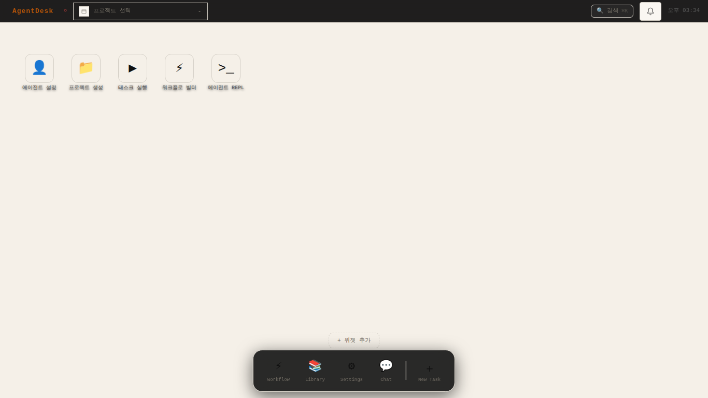
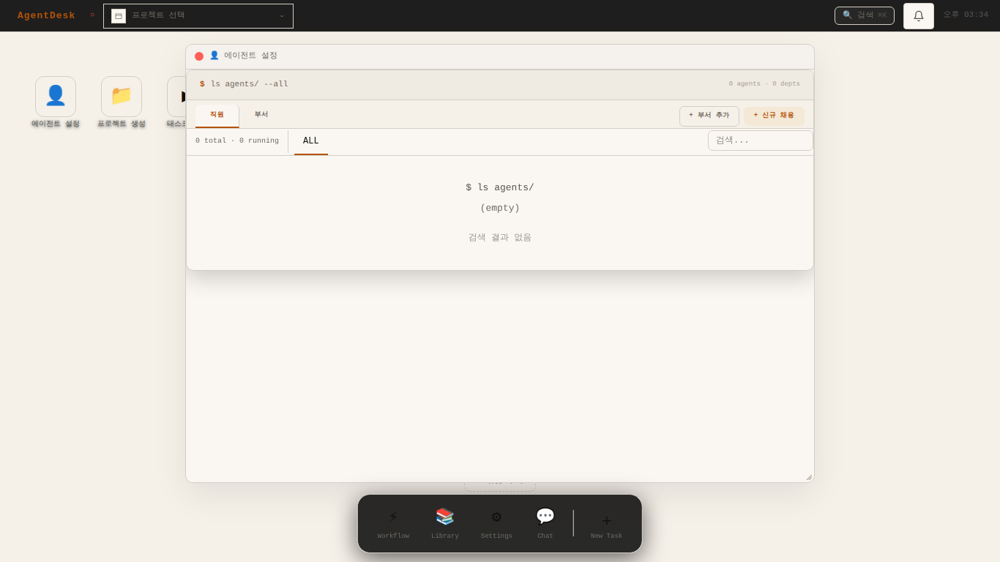
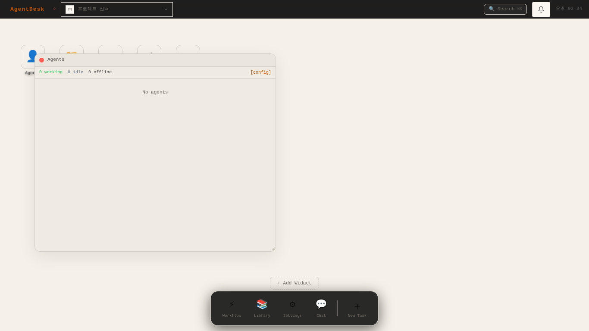
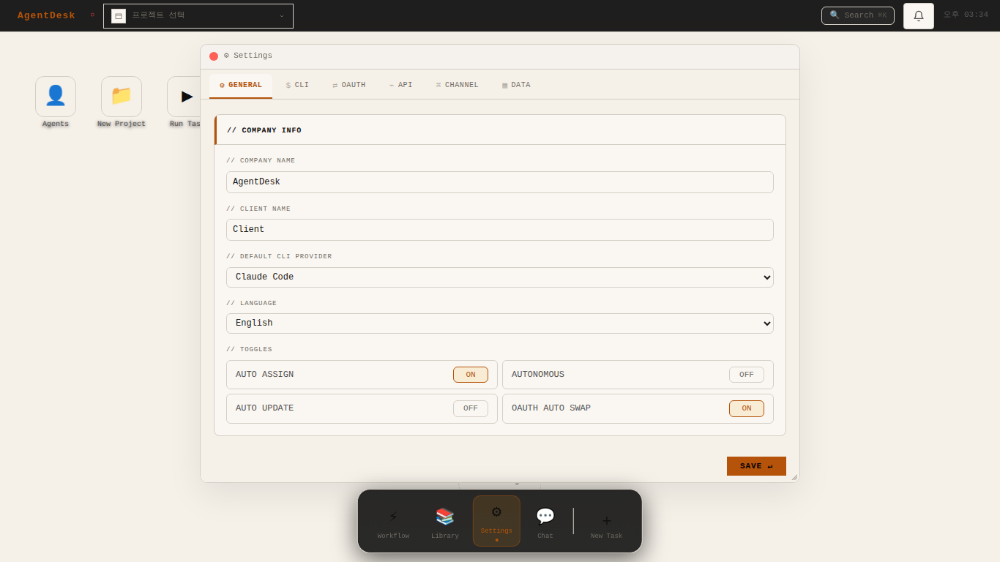
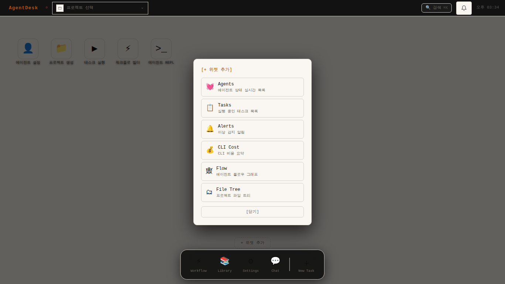
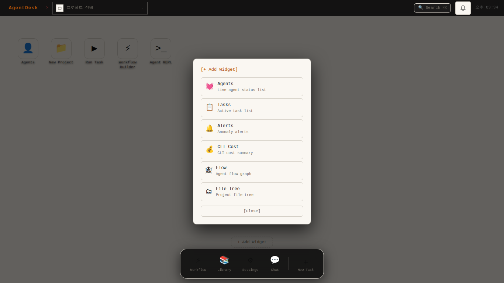
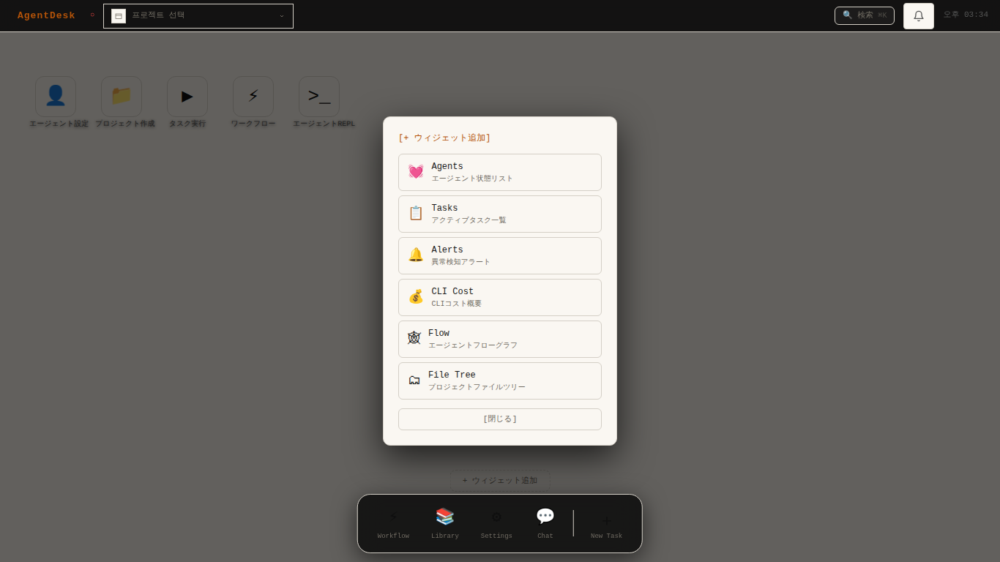
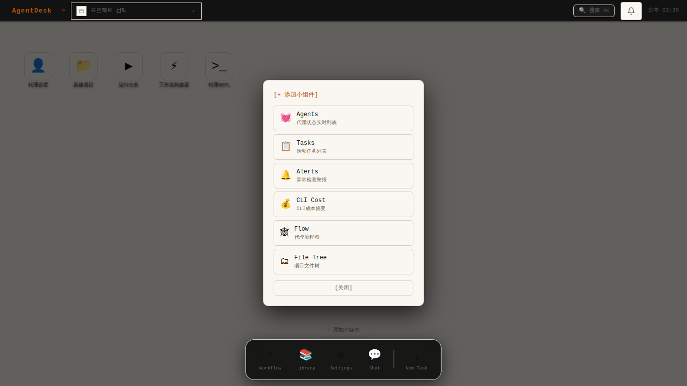
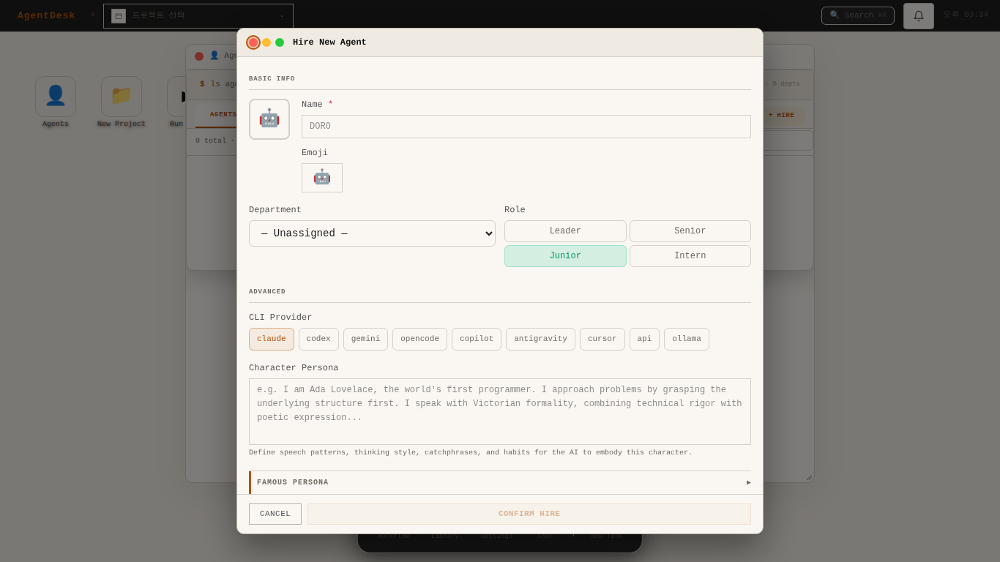
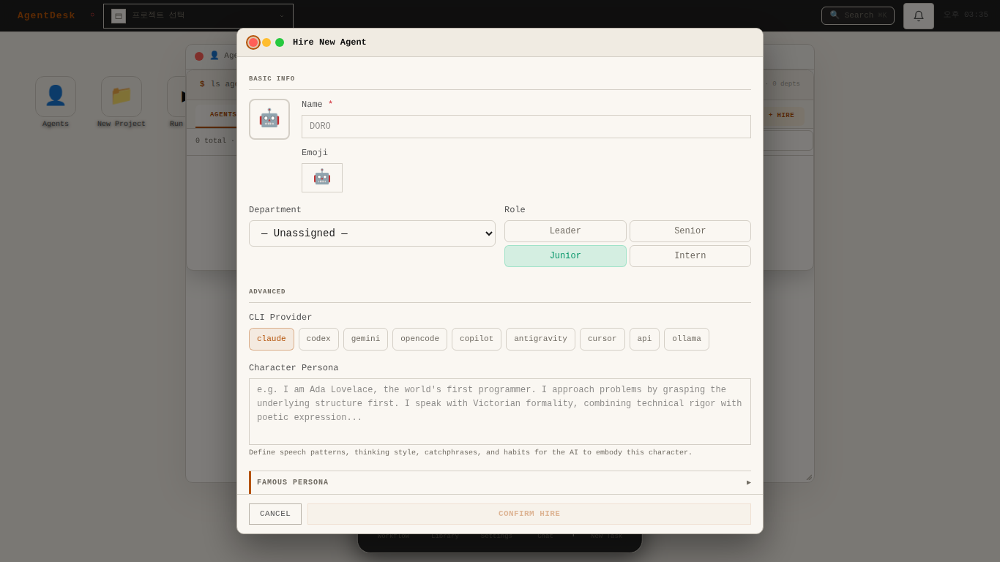

# AgentDesk

> **여러 AI 에이전트를 동시에 실행·모니터링·제어하는 개발자 OS**

AgentDesk는 macOS 바탕화면 은유를 AI 에이전트 오케스트레이션에 적용한 프로젝트 운영체제입니다.
메뉴바, 데스크톱 아이콘, 드래그 가능한 위젯, Dock, 플로팅 앱 창으로 구성된 다크 터미널 인터페이스입니다.

> 🌐 [English README](README.md)

---

## 스크린샷

<table>
  <tr>
    <td><br/><sub>바탕화면</sub></td>
    <td><br/><sub>에이전트 매니저</sub></td>
  </tr>
  <tr>
    <td><br/><sub>직원 등록</sub></td>
    <td><br/><sub>부서 등록</sub></td>
  </tr>
  <tr>
    <td><br/><sub>워크플로 빌더</sub></td>
    <td><br/><sub>에이전트 컴포지션</sub></td>
  </tr>
  <tr>
    <td><br/><sub>다이렉트 채팅</sub></td>
    <td><br/><sub>그룹 방송 채팅</sub></td>
  </tr>
  <tr>
    <td><br/><sub>에이전트 위젯</sub></td>
    <td><br/><sub>알림 위젯</sub></td>
  </tr>
  <tr>
    <td><br/><sub>설정</sub></td>
    <td><br/><sub>라이브러리 — Skills</sub></td>
  </tr>
  <tr>
    <td><br/><sub>미션 컨트롤 (Ctrl+↑)</sub></td>
    <td><br/><sub>커맨드 팔레트 (Ctrl+Shift+K)</sub></td>
  </tr>
</table>

---

## AgentDesk란?

AgentDesk는 AI 에이전트 팀을 위한 **프로젝트 운영체제**입니다. 로컬 웹앱으로 실행되며 다음을 지원합니다:

- **AI 에이전트 생성·관리** — 페르소나, 역할, 부서, CLI 프로바이더, API 모델 설정
- **워크플로 오케스트레이션** — 비주얼 빌더, 스케줄 태스크, 멀티 에이전트 컴포지션 파이프라인
- **실시간 모니터링** — 하트비트 위젯, 태스크 보드, 알림 피드, 플로우 그래프, CLI 비용 추적
- **에이전트와 채팅** — 다이렉트 메시지, 그룹 방송, Telegram/Discord/Slack 게이트웨이
- **공유 지식 베이스** — Skills, Rules, Memory, Hooks, Deliverables 라이브러리
- **모든 것을 제어** — macOS 스타일 데스크톱 (Spotlight 검색, 미션 컨트롤, Quick Look)

---

## 주요 기능

### 🖥️ macOS 스타일 데스크톱 OS
- 메뉴바 + 데스크톱 아이콘 + Dock + 플로팅 창
- 드래그&드롭 아이콘 배치 + Jiggle Mode (600ms 롱프레스)
- Quick Look (Space) — 프로젝트 빠른 미리보기
- Mission Control (Ctrl+↑) — 모든 창·위젯 오버뷰
- Spotlight 스타일 커맨드 팔레트 (Ctrl+Shift+K)
- 10가지 그라데이션 배경화면 테마

### 👤 에이전트·부서 관리
- 커스텀 아바타, 페르소나, 역할 레벨(팀장/시니어/주니어/인턴)로 에이전트 채용
- 공유 시스템 프롬프트를 가진 부서 단위 조직 구성
- CLI 프로바이더(Claude, OpenAI, Gemini 등) 또는 API 모델 배정
- 실시간 하트비트 모니터링

### ⚡ 워크플로 자동화
- 비주얼 드래그&드롭 워크플로 빌더
- 크론 표현식 스케줄 태스크
- 커스텀 노드 타입의 멀티 에이전트 컴포지션 파이프라인
- 7가지 내장 워크플로 팩 (개발, 리서치, 소설, 보고서, 영상, 롤플레이, 에셋 관리)

### 💬 멀티 에이전트 채팅
- 개별 에이전트 다이렉트 메시지
- 전체 에이전트 그룹 방송 채널
- Telegram / Discord / Slack 게이트웨이 연동
- 메신저 `$` 지시문 및 `!` 태스크 플로우

### 📚 지식 라이브러리
- **Skills** — 재사용 가능한 태스크 템플릿
- **Rules** — 에이전트 행동 규칙·가이드라인
- **Memory** — 지속적 에이전트 컨텍스트
- **Hooks** — 이벤트 기반 자동화 스크립트
- **Deliverables** — 산출물 아티팩트 추적

### 📊 실시간 대시보드 위젯

| 위젯 | 설명 |
|------|------|
| 💓 에이전트 | 에이전트 상태 실시간 목록 (working / idle / offline) |
| 📋 태스크 | 활성 태스크 보드 |
| 🔔 알림 | 이상 감지·오류 알림 |
| 💰 CLI 비용 | 토큰 사용량·속도 제한 추적 |
| 🔀 플로우 그래프 | 에이전트 통신 흐름 그래프 |
| 🗂 파일 트리 | 프로젝트 디렉토리 브라우저 |

---

## 🌍 다국어 지원

언어 설정에 따라 모든 UI 텍스트가 자동으로 전환됩니다 — **한국어 · English · 日本語 · 中文**

### 앱 메뉴

<table>
  <tr>
    <th>🇰🇷 한국어</th>
    <th>🇺🇸 English</th>
    <th>🇯🇵 日本語</th>
    <th>🇨🇳 中文</th>
  </tr>
  <tr>
    <td></td>
    <td></td>
    <td></td>
    <td></td>
  </tr>
</table>

### 위젯 추가 피커

<table>
  <tr>
    <th>🇰🇷 한국어</th>
    <th>🇺🇸 English</th>
    <th>🇯🇵 日本語</th>
    <th>🇨🇳 中文</th>
  </tr>
  <tr>
    <td></td>
    <td></td>
    <td></td>
    <td></td>
  </tr>
</table>

### 미션 컨트롤

<table>
  <tr>
    <th>🇰🇷 한국어</th>
    <th>🇺🇸 English</th>
    <th>🇯🇵 日本語</th>
    <th>🇨🇳 中文</th>
  </tr>
  <tr>
    <td></td>
    <td></td>
    <td></td>
    <td></td>
  </tr>
</table>

### 직원 등록 모달

<table>
  <tr>
    <th>🇰🇷 한국어</th>
    <th>🇺🇸 English</th>
    <th>🇯🇵 日本語</th>
    <th>🇨🇳 中文</th>
  </tr>
  <tr>
    <td></td>
    <td></td>
    <td></td>
    <td></td>
  </tr>
</table>

---

## 기술 스택

| 영역 | 기술 |
|------|------|
| 프론트엔드 | React 18 + TypeScript + Vite + Tailwind CSS |
| 상태관리 | Zustand |
| 플로우 다이어그램 | `@xyflow/react` v12 |
| 백엔드 | Node.js + Express + tsx |
| 데이터베이스 | SQLite (`better-sqlite3`) + 버전별 마이그레이션 |
| 실시간 통신 | WebSocket |
| 로깅 | pino |
| 테스트 | Vitest (유닛 + 통합) + Playwright (E2E) |
| 패키지 매니저 | pnpm |
| 데스크톱 앱 | Electron (선택적 빌드) |

---

## 빠른 시작

**필요 환경:** Node.js ≥ 22, pnpm ≥ 10

```bash
git clone <repo-url> && cd AgentDesk
pnpm install
cp .env.example .env      # 환경변수 설정 (SESSION_SECRET 필수)
pnpm setup                # DB 초기화 + 마이그레이션
pnpm dev                  # 프론트(8800) + API 서버(8790) 동시 시작
```

브라우저에서 **http://localhost:8800** 접속

### 첫 에이전트 등록 흐름

```
1. Settings → API → API 프로바이더 추가 (Claude / OpenAI / Gemini 등)
2. 에이전트 매니저 → 부서 추가 → 직원 채용
3. 바탕화면 → 📁 프로젝트 생성 → 에이전트 배정
4. 라이브러리 → Rules / Memory / Hooks 설정 (선택)
5. 바탕화면 → ▶ 태스크 실행 → 터미널 패널에서 실시간 모니터링
```

### 주요 명령어

| 명령어 | 설명 |
|--------|------|
| `pnpm dev` | 개발 서버 시작 (프론트 + API) |
| `pnpm build` | 프로덕션 빌드 |
| `pnpm test` | 전체 테스트 실행 |
| `pnpm run test:web` | 프론트 테스트만 (Vitest) |
| `pnpm run test:api` | 서버 테스트만 (Vitest) |
| `pnpm lint` | 린트 검사 |
| `pnpm lint:fix` | 린트 자동 수정 |
| `pnpm setup` | DB 마이그레이션 재실행 |

### 키보드 단축키

| 단축키 | 동작 |
|--------|------|
| `Ctrl+Shift+K` / `Cmd+K` | 커맨드 팔레트 |
| `Ctrl+↑` | 미션 컨트롤 |
| `g w` | 워크플로 창 토글 |
| `g l` | 라이브러리 창 토글 |
| `g s` | 설정 창 토글 |
| `g c` | 채팅 창 토글 |
| `g a` | 에이전트 매니저 토글 |
| `g e` | REPL 토글 |
| `Space` | Quick Look (아이콘 선택 후) |
| `?` | 키보드 단축키 가이드 |

---

## 문서

| 문서 | 내용 |
|------|------|
| [`docs/OVERVIEW.md`](docs/OVERVIEW.md) | 아키텍처 개요 + 기능 완성도 로드맵 |
| [`docs/architecture/ARCHITECTURE-AUDIT-2026-Q1.md`](docs/architecture/ARCHITECTURE-AUDIT-2026-Q1.md) | 아키텍처 & 백엔드 감사 보고서 |
| [`docs/design/UI-SCREENS.md`](docs/design/UI-SCREENS.md) | 전체 화면·모달 명세 |
| [`docs/design/DESIGN.md`](docs/design/DESIGN.md) | CSS 변수 + 컴포넌트 스타일 규칙 |
| [`docs/specs/api.md`](docs/specs/api.md) | REST API 전체 명세 |

---

## 라이선스

Apache 2.0
