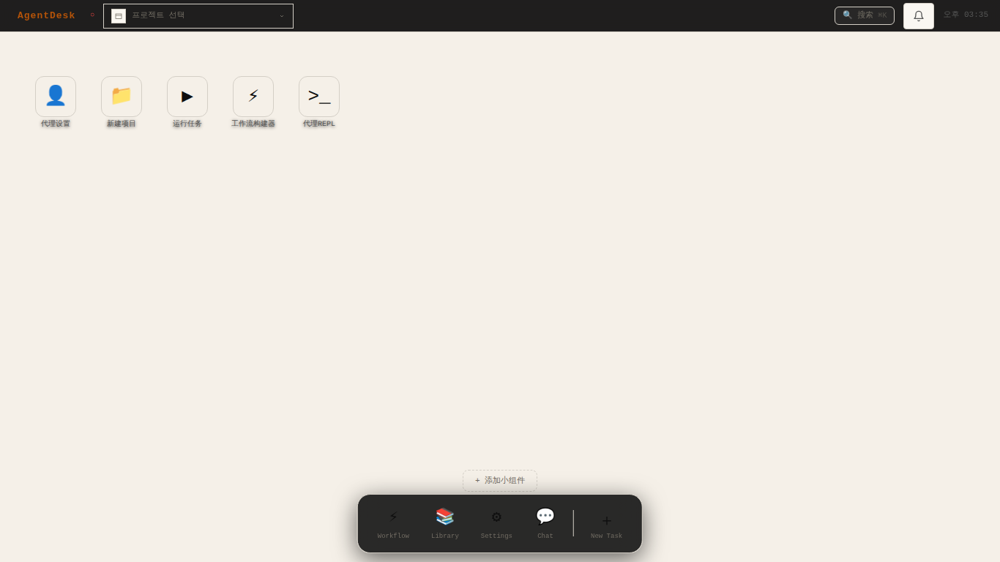
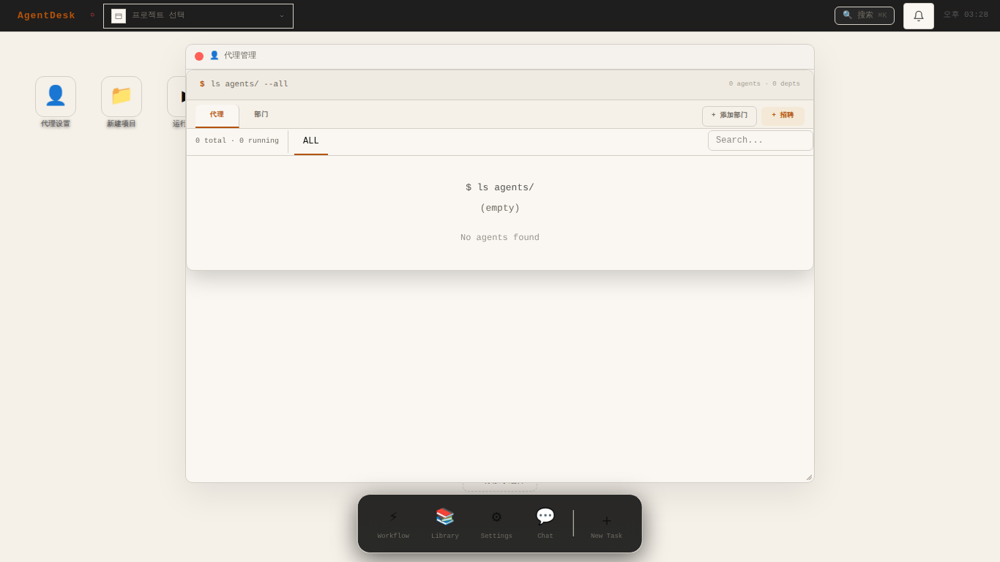
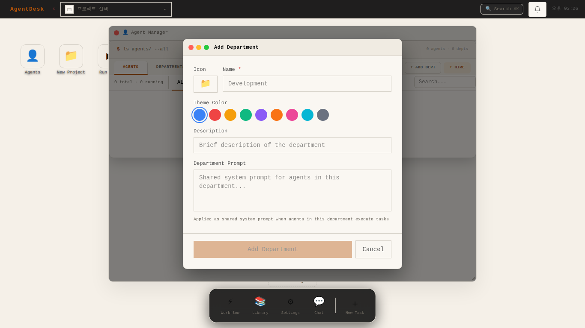
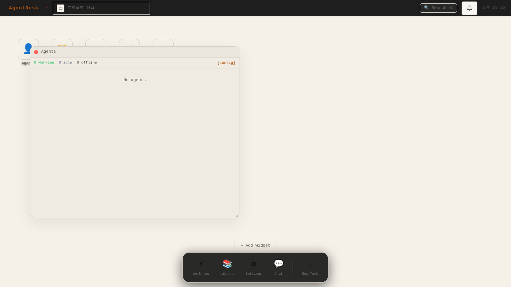
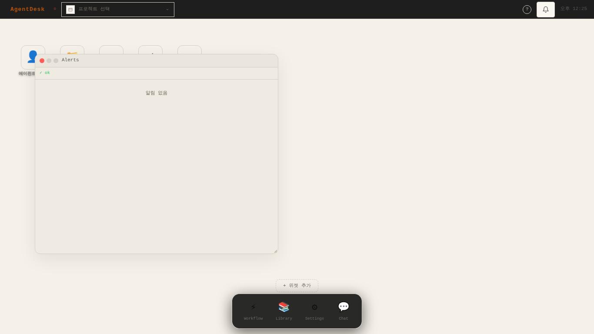
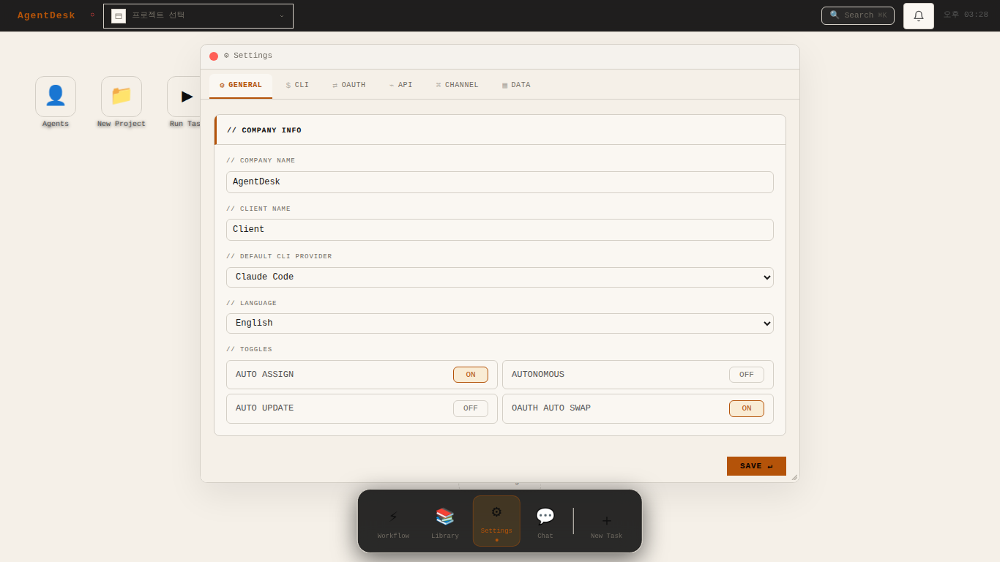
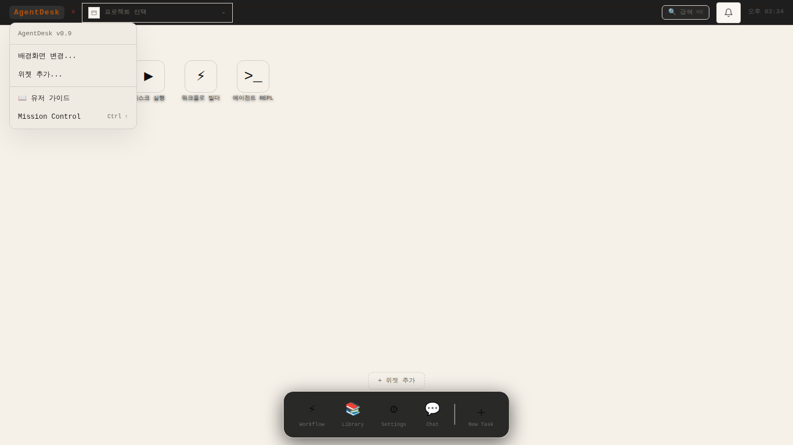
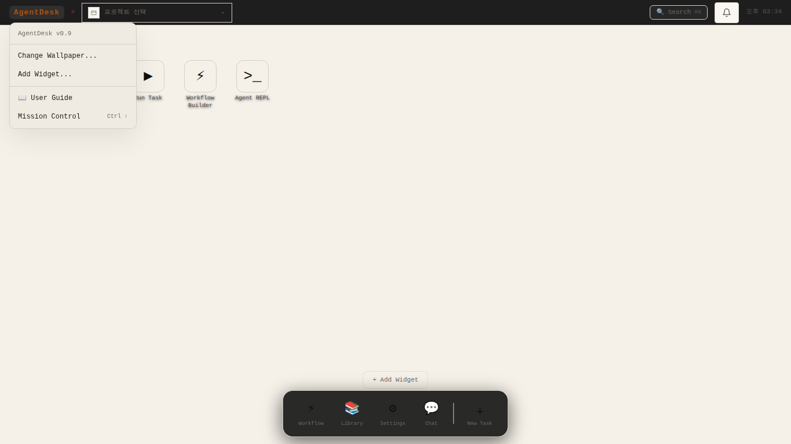
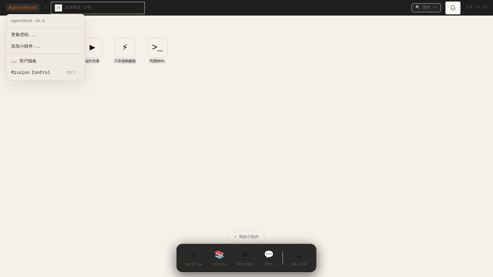

# AgentDesk

> **同时运行、监控和控制多个AI代理的开发者操作系统**

AgentDesk将macOS桌面隐喻应用于AI代理编排——菜单栏、桌面图标、可拖动小组件、Dock和浮动应用窗口，构成完整的深色终端风格界面。

> 🌐 [English README](README.md) · [한국어](README_ko.md) · [日本語](README_jp.md)

---

## 截图

<table>
  <tr>
    <td><br/><sub>桌面</sub></td>
    <td><br/><sub>代理管理器</sub></td>
  </tr>
  <tr>
    <td><br/><sub>招聘代理</sub></td>
    <td><br/><sub>添加部门</sub></td>
  </tr>
  <tr>
    <td><br/><sub>工作流构建器</sub></td>
    <td><br/><sub>代理编排</sub></td>
  </tr>
  <tr>
    <td><br/><sub>直接聊天</sub></td>
    <td><br/><sub>群组广播聊天</sub></td>
  </tr>
  <tr>
    <td><br/><sub>代理小组件</sub></td>
    <td><br/><sub>警报小组件</sub></td>
  </tr>
  <tr>
    <td><br/><sub>设置</sub></td>
    <td><br/><sub>库 — Skills</sub></td>
  </tr>
  <tr>
    <td><br/><sub>任务控制 (Ctrl+↑)</sub></td>
    <td><br/><sub>命令面板 (Ctrl+Shift+K)</sub></td>
  </tr>
</table>

---

## AgentDesk是什么？

AgentDesk是面向AI代理团队的**项目操作系统**。作为本地Web应用运行，提供以下功能：

- **创建和管理AI代理** — 设置角色、部门、CLI提供商、API模型
- **工作流编排** — 可视化构建器、定时任务、多代理组合管道
- **实时监控** — 心跳小组件、任务看板、警报推送、流程图、CLI成本追踪
- **与代理聊天** — 直接消息、群组广播、Telegram/Discord/Slack网关
- **共享知识库** — Skills、Rules、Memory、Hooks、Deliverables库
- **全面控制** — macOS风格桌面（Spotlight搜索、任务控制、快速预览）

---

## 主要功能

### 🖥️ macOS风格桌面OS
- 菜单栏 + 桌面图标 + Dock + 浮动窗口
- 拖放图标布局 + Jiggle模式（600ms长按）
- 快速预览（Space）— 项目快速预览
- 任务控制（Ctrl+↑）— 所有窗口和小组件概览
- Spotlight风格命令面板（Ctrl+Shift+K）
- 10种渐变壁纸主题

### 👤 代理与部门管理
- 以自定义头像、人物设定、职级（团队负责人/高级/初级/实习生）招聘代理
- 构建具有共享系统提示的部门组织
- 分配CLI提供商（Claude、OpenAI、Gemini等）或API模型
- 实时心跳监控

### ⚡ 工作流自动化
- 可视化拖放工作流构建器
- Cron表达式定时任务
- 自定义节点类型的多代理组合管道
- 7种内置工作流包（开发、研究、小说、报告、视频、角色扮演、资产管理）

### 💬 多代理聊天
- 对单个代理的直接消息
- 全体代理群组广播频道
- Telegram / Discord / Slack网关集成
- 消息端`$`指令和`!`任务流

### 📚 知识库
- **Skills** — 可复用的任务模板
- **Rules** — 代理行为约束和指导方针
- **Memory** — 持久化代理上下文
- **Hooks** — 事件驱动自动化脚本
- **Deliverables** — 输出成果物追踪

### 📊 实时仪表盘小组件

| 小组件 | 说明 |
|--------|------|
| 💓 代理 | 代理状态实时列表 (working / idle / offline) |
| 📋 任务 | 活动任务看板 |
| 🔔 警报 | 异常检测和错误通知 |
| 💰 CLI成本 | Token使用量和速率限制追踪 |
| 🔀 流程图 | 代理通信流程图 |
| 🗂 文件树 | 项目目录浏览器 |

---

## 🌍 多语言支持

根据语言设置，所有UI文本自动切换 — **한국어 · English · 日本語 · 中文**

### 应用菜单

<table>
  <tr>
    <th>🇰🇷 한국어</th>
    <th>🇺🇸 English</th>
    <th>🇯🇵 日本語</th>
    <th>🇨🇳 中文</th>
  </tr>
  <tr>
    <td></td>
    <td></td>
    <td></td>
    <td></td>
  </tr>
</table>

### 任务控制

<table>
  <tr>
    <th>🇰🇷 한국어</th>
    <th>🇺🇸 English</th>
    <th>🇯🇵 日本語</th>
    <th>🇨🇳 中文</th>
  </tr>
  <tr>
    <td></td>
    <td></td>
    <td></td>
    <td></td>
  </tr>
</table>

---

## 技术栈

| 层 | 技术 |
|----|------|
| 前端 | React 18 + TypeScript + Vite + Tailwind CSS |
| 状态管理 | Zustand |
| 流程图 | `@xyflow/react` v12 |
| 后端 | Node.js + Express + tsx |
| 数据库 | SQLite (`better-sqlite3`) + 版本化迁移 |
| 实时通信 | WebSocket |
| 日志 | pino |
| 测试 | Vitest (单元 + 集成) + Playwright (E2E) |
| 包管理器 | pnpm |
| 桌面应用 | Electron (可选构建) |

---

## 快速开始

**环境要求:** Node.js ≥ 22, pnpm ≥ 10

```bash
git clone <repo-url> && cd AgentDesk
pnpm install
cp .env.example .env      # 设置环境变量 (SESSION_SECRET 必填)
pnpm setup                # 初始化数据库 + 迁移
pnpm dev                  # 前端(8800) + API服务器(8790)
```

在浏览器中打开 **http://localhost:8800**

### 首个代理注册流程

```
1. Settings → API → 添加API提供商 (Claude / OpenAI / Gemini)
2. 代理管理器 → 添加部门 → 招聘代理
3. 桌面 → 📁 新建项目 → 分配代理
4. 库 → 配置 Rules / Memory / Hooks（可选）
5. 桌面 → ▶ 运行任务 → 在终端面板实时监控
```

### 键盘快捷键

| 快捷键 | 操作 |
|--------|------|
| `Ctrl+Shift+K` / `Cmd+K` | 命令面板 |
| `Ctrl+↑` | 任务控制 |
| `g w` | 切换工作流窗口 |
| `g l` | 切换库窗口 |
| `g s` | 切换设置窗口 |
| `g c` | 切换聊天窗口 |
| `g a` | 切换代理管理器 |
| `g e` | 切换REPL |
| `Space` | 快速预览（选中图标后） |
| `?` | 键盘快捷键指南 |

---

## 文档

| 文档 | 内容 |
|------|------|
| [`docs/OVERVIEW.md`](docs/OVERVIEW.md) | 架构概述 + 功能完成度路线图 |
| [`docs/design/AI-GUIDE.md`](docs/design/AI-GUIDE.md) | AI开发者设计原则 |
| [`docs/design/UI-SCREENS.md`](docs/design/UI-SCREENS.md) | 完整界面和模态框规范 |
| [`docs/specs/api.md`](docs/specs/api.md) | REST API完整规范 |

---

## 许可证

Apache 2.0
