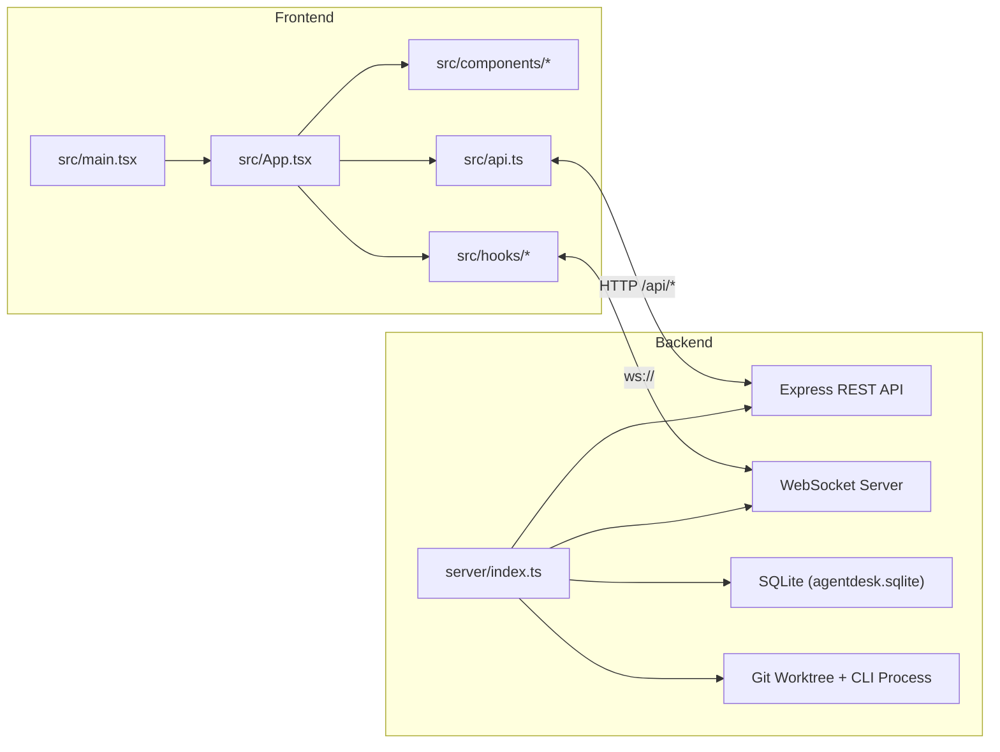
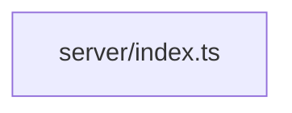

# Architecture Map

Generated at: 2026-03-09T12:23:55.456Z

## How to Regenerate

```bash
npm run arch:map
```

> **Note:** 생성된 Project Tree의 `docs/` 하위 목록은 스크립트 실행 시점 기준이며, 실제 문서 인덱스는 [docs/README.md](../README.md)를 참조하세요.

## System Overview



## Project Tree

```text
AgentDesk
├── .claude/
│   └── settings.local.json
├── .cursor/
│   ├── commands/
│   │   └── project-commands.md
│   ├── hooks/
│   │   └── README.md
│   ├── rules/
│   │   ├── agents.mdc
│   │   └── coding-conventions.mdc
│   ├── skills/
│   │   └── analyze-patterns-create-skills/
│   │       ├── reference.md
│   │       └── SKILL.md
│   ├── hooks.json
│   └── mcp.json
├── dist-server/
│   ├── agentdesk-server.cjs
│   └── agentdesk-server.cjs.map
├── docs/
│   ├── architecture/
│   │   ├── architecture.json
│   │   ├── backend-dependencies.mmd
│   │   ├── frontend-imports.mmd
│   │   ├── org-chart.mmd
│   │   ├── README.md
│   │   ├── source-tree.txt
│   │   └── SYSTEM-STRUCTURE-MAP.md
│   ├── design/
│   │   ├── agentdesk-2.0-menu-spec.md
│   │   ├── dashboard-office-pack-steps.md
│   │   ├── DESIGN_SKILLS.md
│   │   ├── design-retro-terminal-overhaul.md
│   │   ├── design-system.md
│   │   └── DESIGN.md
│   ├── plans/
│   │   ├── 2026-02-25-server-types-nocheck-removal.md
│   │   ├── 2026-02-27-workflow-pack-mvp.md
│   │   └── heartbeat-logs-guide.md
│   ├── reference/
│   │   ├── exe-packaging-plan.md
│   │   ├── office-pack-phase17.md
│   │   ├── phaser-migration.md
│   │   └── progress.md
│   ├── reports/
│   │   ├── Sample_Slides/
│   │   │   ├── build-pptx.cjs
│   │   │   ├── build-pptx.mjs
│   │   │   ├── html2pptx.cjs
│   │   │   ├── slide-01.html
│   │   │   ├── slide-02.html
│   │   │   ├── slide-03.html
│   │   │   ├── slide-04.html
│   │   │   ├── slide-05.html
│   │   │   ├── slide-06.html
│   │   │   ├── slide-07.html
│   │   │   ├── slide-08.html
│   │   │   └── slide-09.html
│   │   └── AgentDesk-Analysis-Report.pptx
│   ├── review/
│   │   └── prd-planning-review-2026-03-09.md
│   ├── specs/
│   │   ├── api.md
│   │   ├── deliverables-spec.md
│   │   └── openapi.json
│   ├── strategy/
│   │   ├── 필요-기능-분석.md
│   │   ├── agent-persona-system.md
│   │   ├── agentdesk-vs-openai-symphony.md
│   │   ├── claw-empire-comparison.md
│   │   ├── claw-empire-differentiation-plan.md
│   │   ├── pack-identity-system.md
│   │   └── ui-differentiation-strategy.md
│   └── README.md
├── electron/
│   └── main.cjs
├── public/
│   ├── assets/
│   │   └── themes/
│   │       ├── business/
│   │       │   ├── bookshelf.svg
│   │       │   ├── ceiling-light.svg
│   │       │   ├── chair.svg
│   │       │   ├── clock-face.svg
│   │       │   ├── coffee-machine.svg
│   │       │   ├── coffee-table.svg
│   │       │   ├── desk.svg
│   │       │   ├── high-table.svg
│   │       │   ├── monitor-off.svg
│   │       │   ├── monitor-on.svg
│   │       │   ├── picture-frame.svg
│   │       │   ├── plant.svg
│   │       │   ├── sofa.svg
│   │       │   ├── trash-can.svg
│   │       │   ├── vending-machine.svg
│   │       │   ├── water-cooler.svg
│   │       │   ├── whiteboard.svg
│   │       │   └── window.svg
│   │       ├── cyber/
│   │       │   ├── bookshelf.svg
│   │       │   ├── ceiling-light.svg
│   │       │   ├── chair.svg
│   │       │   ├── clock-face.svg
│   │       │   ├── coffee-machine.svg
│   │       │   ├── coffee-table.svg
│   │       │   ├── desk.svg
│   │       │   ├── high-table.svg
│   │       │   ├── monitor-off.svg
│   │       │   ├── monitor-on.svg
│   │       │   ├── picture-frame.svg
│   │       │   ├── plant.svg
│   │       │   ├── sofa.svg
│   │       │   ├── trash-can.svg
│   │       │   ├── vending-machine.svg
│   │       │   ├── water-cooler.svg
│   │       │   ├── whiteboard.svg
│   │       │   └── window.svg
│   │       └── retro/
│   │           ├── bookshelf.svg
│   │           ├── ceiling-light.svg
│   │           ├── chair.svg
│   │           ├── clock-face.svg
│   │           ├── coffee-machine.svg
│   │           ├── coffee-table.svg
│   │           ├── desk.svg
│   │           ├── high-table.svg
│   │           ├── monitor-off.svg
│   │           ├── monitor-on.svg
│   │           ├── picture-frame.svg
│   │           ├── plant.svg
│   │           ├── sofa.svg
│   │           ├── trash-can.svg
│   │           ├── vending-machine.svg
│   │           ├── water-cooler.svg
│   │           ├── whiteboard.svg
│   │           └── window.svg
│   ├── public/sprites/ (71 sprite files)
│   ├── agentdesk-icon.svg
│   ├── agentdesk.png
│   ├── agentdesk.svg
│   └── favicon.svg
├── release/
│   ├── win-unpacked/
│   │   ├── release/win-unpacked/locales/ (55 files)
│   │   ├── resources/
│   │   │   ├── app.asar.unpacked/
│   │   │   ├── app-update.yml
│   │   │   ├── app.asar
│   │   │   └── elevate.exe
│   │   ├── AgentDesk.exe
│   │   ├── chrome_100_percent.pak
│   │   ├── chrome_200_percent.pak
│   │   ├── d3dcompiler_47.dll
│   │   ├── ffmpeg.dll
│   │   ├── icudtl.dat
│   │   ├── libEGL.dll
│   │   ├── libGLESv2.dll
│   │   ├── LICENSE.electron.txt
│   │   ├── LICENSES.chromium.html
│   │   ├── resources.pak
│   │   ├── snapshot_blob.bin
│   │   ├── v8_context_snapshot.bin
│   │   ├── vk_swiftshader_icd.json
│   │   ├── vk_swiftshader.dll
│   │   └── vulkan-1.dll
│   ├── AgentDesk-2.0.1-portable.exe
│   ├── AgentDesk-Setup-2.0.1.exe
│   ├── AgentDesk-Setup-2.0.1.exe.blockmap
│   ├── builder-debug.yml
│   ├── builder-effective-config.yaml
│   └── latest.yml
├── scripts/
│   ├── qa/
│   │   ├── office-theme-requirements-lib/
│   │   │   ├── constants.mjs
│   │   │   ├── contrast-audit.mjs
│   │   │   ├── reporting.mjs
│   │   │   ├── run.mjs
│   │   │   └── theme-helpers.mjs
│   │   ├── api-comm-test.mjs
│   │   ├── connectivity-lib.mjs
│   │   ├── interrupt-inject-http-smoke.mjs
│   │   ├── llm-comm-test.mjs
│   │   ├── oauth-comm-test.mjs
│   │   ├── office-console-smoke.mjs
│   │   ├── office-management-requirements.mjs
│   │   ├── office-performance-baseline.mjs
│   │   ├── office-resolution-compare.mjs
│   │   ├── office-theme-requirements.mjs
│   │   ├── project-path-api-smoke.mjs
│   │   └── run-comm-suite.mjs
│   ├── auto-apply-v1.0.5.mjs
│   ├── build-server.mjs
│   ├── convert-slides.mjs
│   ├── ensure-remotion-runtime.mjs
│   ├── generate-architecture-report.mjs
│   ├── generate-doro-sprites.mjs
│   ├── generate-intro-ppt.mjs
│   ├── migrate-custom-skills-canonical.mjs
│   ├── openapi-contract.mjs
│   ├── openclaw-setup.ps1
│   ├── preflight-public.sh
│   ├── prepare-e2e-runtime.mjs
│   ├── setup.mjs
│   ├── setup.ps1
│   ├── setup.sh
│   ├── test-comm-status.mjs
│   └── verify-security-audit-log.mjs
├── server/
│   ├── config/
│   │   └── runtime.ts
│   ├── db/
│   │   ├── runtime.test.ts
│   │   └── runtime.ts
│   ├── gateway/
│   │   ├── client.test.ts
│   │   └── client.ts
│   ├── messenger/
│   │   ├── channels.ts
│   │   ├── discord-receiver.test.ts
│   │   ├── discord-receiver.ts
│   │   ├── session-agent-routing.test.ts
│   │   ├── session-agent-routing.ts
│   │   ├── telegram-receiver.test.ts
│   │   ├── telegram-receiver.ts
│   │   ├── token-crypto.ts
│   │   └── token-hint.ts
│   ├── modules/
│   │   ├── bootstrap/
│   │   │   ├── schema/
│   │   │   │   ├── base-schema.ts
│   │   │   │   ├── oauth-runtime.ts
│   │   │   │   ├── seeds.ts
│   │   │   │   ├── task-schema-migrations.ts
│   │   │   │   └── workflow-pack-seeds.ts
│   │   │   ├── helpers.ts
│   │   │   ├── message-idempotency.ts
│   │   │   └── security-audit.ts
│   │   ├── lifecycle/
│   │   │   └── register-graceful-shutdown.ts
│   │   ├── routes/
│   │   │   ├── collab/
│   │   │   │   ├── coordination/
│   │   │   │   │   ├── cross-dept-cooperation.ts
│   │   │   │   │   ├── cross-dept-subtasks.ts
│   │   │   │   │   ├── report-routing.ts
│   │   │   │   │   └── types.ts
│   │   │   │   ├── announcement-response.ts
│   │   │   │   ├── chat-response.ts
│   │   │   │   ├── coordination.ts
│   │   │   │   ├── direct-chat-handlers.ts
│   │   │   │   ├── direct-chat-intent-utils.ts
│   │   │   │   ├── direct-chat-progress-summary.ts
│   │   │   │   ├── direct-chat-project-binding.ts
│   │   │   │   ├── direct-chat-runtime-reply.ts
│   │   │   │   ├── direct-chat-task-flow.pack-inference.test.ts
│   │   │   │   ├── direct-chat-task-flow.ts
│   │   │   │   ├── direct-chat-types.ts
│   │   │   │   ├── direct-chat.normalize.test.ts
│   │   │   │   ├── direct-chat.ts
│   │   │   │   ├── language-policy.test.ts
│   │   │   │   ├── language-policy.ts
│   │   │   │   ├── office-pack-agent-hydration.test.ts
│   │   │   │   ├── office-pack-agent-hydration.ts
│   │   │   │   ├── project-resolution.ts
│   │   │   │   ├── subtask-delegation-batch-messages.ts
│   │   │   │   ├── subtask-delegation-batch.ts
│   │   │   │   ├── subtask-delegation-prompt.ts
│   │   │   │   ├── subtask-delegation.ts
│   │   │   │   ├── subtask-summary.ts
│   │   │   │   ├── task-delegation-messages.ts
│   │   │   │   └── task-delegation.ts
│   │   │   ├── core/
│   │   │   │   ├── agents/
│   │   │   │   │   ├── crud.seed-filter.test.ts
│   │   │   │   │   ├── crud.ts
│   │   │   │   │   ├── index.ts
│   │   │   │   │   ├── process-inspector.ts
│   │   │   │   │   ├── spawn.ts
│   │   │   │   │   └── sprites.ts
│   │   │   │   ├── projects/
│   │   │   │   │   └── helpers.ts
│   │   │   │   ├── tasks/
│   │   │   │   │   ├── crud.ts
│   │   │   │   │   ├── crud.workflow-pack-filter.test.ts
│   │   │   │   │   ├── execution-control.test.ts
│   │   │   │   │   ├── execution-control.ts
│   │   │   │   │   ├── execution-run-auto-assign.test.ts
│   │   │   │   │   ├── execution-run-auto-assign.ts
│   │   │   │   │   ├── execution-run.ts
│   │   │   │   │   ├── execution.ts
│   │   │   │   │   └── subtasks.ts
│   │   │   │   ├── update-auto/
│   │   │   │   │   ├── apply-update.ts
│   │   │   │   │   ├── command-capture.ts
│   │   │   │   │   └── register.ts
│   │   │   │   ├── departments.ts
│   │   │   │   ├── github-routes.ts
│   │   │   │   ├── office-packs.ts
│   │   │   │   ├── pipeline-gates.ts
│   │   │   │   ├── projects.ts
│   │   │   │   ├── task-dependencies.ts
│   │   │   │   ├── task-templates.ts
│   │   │   │   └── webhooks.ts
│   │   │   ├── ops/
│   │   │   │   ├── hooks-learning/
│   │   │   │   │   ├── learn-core.ts
│   │   │   │   │   ├── routes.ts
│   │   │   │   │   └── types.ts
│   │   │   │   ├── memory-learning/
│   │   │   │   │   ├── learn-core.ts
│   │   │   │   │   ├── routes.ts
│   │   │   │   │   └── types.ts
│   │   │   │   ├── messages/
│   │   │   │   │   ├── decision-inbox/
│   │   │   │   │   │   ├── messenger-bridge.ts
│   │   │   │   │   │   ├── messenger-notice-format.ts
│   │   │   │   │   │   ├── project-review-planning.ts
│   │   │   │   │   │   ├── project-review-reply.test.ts
│   │   │   │   │   │   ├── project-review-reply.ts
│   │   │   │   │   │   ├── project-timeout-items.ts
│   │   │   │   │   │   ├── review-round-items.ts
│   │   │   │   │   │   ├── review-round-planning.ts
│   │   │   │   │   │   ├── review-round-reply.ts
│   │   │   │   │   │   ├── state-helpers.ts
│   │   │   │   │   │   ├── timeout-reply.ts
│   │   │   │   │   │   ├── types.ts
│   │   │   │   │   │   ├── yolo-mode.test.ts
│   │   │   │   │   │   └── yolo-mode.ts
│   │   │   │   │   ├── announcements-routes.ts
│   │   │   │   │   ├── chat-routes.ts
│   │   │   │   │   ├── decision-inbox-routes.bridge.test.ts
│   │   │   │   │   ├── decision-inbox-routes.ts
│   │   │   │   │   ├── directive-leader-scope.test.ts
│   │   │   │   │   ├── directive-leader-scope.ts
│   │   │   │   │   └── directives-inbox-routes.ts
│   │   │   │   ├── oauth/
│   │   │   │   │   ├── helpers.ts
│   │   │   │   │   ├── routes.ts
│   │   │   │   │   └── status.ts
│   │   │   │   ├── rule-learning/
│   │   │   │   │   ├── learn-core.ts
│   │   │   │   │   ├── routes.ts
│   │   │   │   │   └── types.ts
│   │   │   │   ├── skills/
│   │   │   │   │   ├── catalog-routes.ts
│   │   │   │   │   ├── learn-constants.ts
│   │   │   │   │   ├── learn-core.ts
│   │   │   │   │   ├── learn-routes.ts
│   │   │   │   │   ├── routes.ts
│   │   │   │   │   └── types.ts
│   │   │   │   ├── task-reports/
│   │   │   │   │   ├── helpers.test.ts
│   │   │   │   │   ├── helpers.ts
│   │   │   │   │   └── routes.ts
│   │   │   │   ├── terminal/
│   │   │   │   │   ├── extract-thinking-blocks.ts
│   │   │   │   │   ├── pretty-stream-json.ts
│   │   │   │   │   ├── progress-hints.ts
│   │   │   │   │   └── routes.ts
│   │   │   │   ├── agent-rules.ts
│   │   │   │   ├── agent-usage.ts
│   │   │   │   ├── api-docs.ts
│   │   │   │   ├── api-providers.ts
│   │   │   │   ├── backup.ts
│   │   │   │   ├── chat-upload.ts
│   │   │   │   ├── custom-skills.ts
│   │   │   │   ├── heartbeat.ts
│   │   │   │   ├── hooks.ts
│   │   │   │   ├── memory.ts
│   │   │   │   ├── messages.ts
│   │   │   │   ├── models-routes.ts
│   │   │   │   ├── notifications.ts
│   │   │   │   ├── scheduled-tasks.ts
│   │   │   │   ├── settings-stats.seed-init.test.ts
│   │   │   │   ├── settings-stats.ts
│   │   │   │   ├── video-render.ts
│   │   │   │   ├── workflow-packs.ts
│   │   │   │   └── worktrees-and-usage.ts
│   │   │   ├── shared/
│   │   │   │   ├── project-assignments.ts
│   │   │   │   └── types.ts
│   │   │   ├── collab.ts
│   │   │   ├── core.ts
│   │   │   ├── ops.ts
│   │   │   ├── update-auto-command.test.ts
│   │   │   ├── update-auto-command.ts
│   │   │   ├── update-auto-lock.test.ts
│   │   │   ├── update-auto-lock.ts
│   │   │   ├── update-auto-policy.test.ts
│   │   │   ├── update-auto-policy.ts
│   │   │   ├── update-auto-utils.test.ts
│   │   │   └── update-auto-utils.ts
│   │   ├── workflow/
│   │   │   ├── agents/
│   │   │   │   ├── providers/
│   │   │   │   │   ├── api-provider-tools.ts
│   │   │   │   │   ├── credential-tools.ts
│   │   │   │   │   ├── http-agent-tools.ts
│   │   │   │   │   ├── oauth-tools.ts
│   │   │   │   │   ├── process-tools.ts
│   │   │   │   │   ├── stream-tools.ts
│   │   │   │   │   ├── types.ts
│   │   │   │   │   └── usage-cli-tools.ts
│   │   │   │   ├── cli-runtime.ts
│   │   │   │   ├── providers.ts
│   │   │   │   ├── subtask-routing.ts
│   │   │   │   └── subtask-seeding.ts
│   │   │   ├── core/
│   │   │   │   ├── worktree/
│   │   │   │   │   ├── lifecycle.test.ts
│   │   │   │   │   ├── lifecycle.ts
│   │   │   │   │   ├── merge.ts
│   │   │   │   │   └── shared.ts
│   │   │   │   ├── character-persona.ts
│   │   │   │   ├── cli-tools.test.ts
│   │   │   │   ├── cli-tools.ts
│   │   │   │   ├── conversation-context-tools.ts
│   │   │   │   ├── conversation-types.ts
│   │   │   │   ├── document-generation-guidance.ts
│   │   │   │   ├── interrupt-injection-tools.test.ts
│   │   │   │   ├── interrupt-injection-tools.ts
│   │   │   │   ├── meeting-prompt-tools.test.ts
│   │   │   │   ├── meeting-prompt-tools.ts
│   │   │   │   ├── one-shot-runner.ts
│   │   │   │   ├── persona-catalog.ts
│   │   │   │   ├── project-context-tools.ts
│   │   │   │   ├── prompt-skills.test.ts
│   │   │   │   ├── prompt-skills.ts
│   │   │   │   ├── reply-core-tools.ts
│   │   │   │   ├── task-execution-meta.ts
│   │   │   │   └── video-skill-bootstrap.ts
│   │   │   ├── orchestration/
│   │   │   │   ├── meetings/
│   │   │   │   │   ├── leader-selection.test.ts
│   │   │   │   │   ├── leader-selection.ts
│   │   │   │   │   ├── minutes.ts
│   │   │   │   │   ├── presence.ts
│   │   │   │   │   ├── review-consensus-outcome.ts
│   │   │   │   │   └── review-consensus.ts
│   │   │   │   ├── run-complete-handler/
│   │   │   │   │   ├── core.ts
│   │   │   │   │   ├── gates.ts
│   │   │   │   │   ├── learnings.ts
│   │   │   │   │   ├── notifications.ts
│   │   │   │   │   ├── state-updates.ts
│   │   │   │   │   └── video-artifact.ts
│   │   │   │   ├── agent-anomaly-monitor.ts
│   │   │   │   ├── autonomous-memory.ts
│   │   │   │   ├── execution-start-task.ts
│   │   │   │   ├── heartbeat.ts
│   │   │   │   ├── meetings.ts
│   │   │   │   ├── planned-approval.ts
│   │   │   │   ├── planning-archive-tools.ts
│   │   │   │   ├── progress-notify-tools.ts
│   │   │   │   ├── report-flow-helpers.ts
│   │   │   │   ├── report-workflow-tools.ts
│   │   │   │   ├── review-finalize-tools.ts
│   │   │   │   ├── review-finalize-tools.video-gate.test.ts
│   │   │   │   ├── run-complete-handler.ts
│   │   │   │   ├── run-complete-handler.video-review.test.ts
│   │   │   │   ├── session-review-tools.ts
│   │   │   │   ├── task-scheduler.ts
│   │   │   │   ├── video-render-delegation-state.ts
│   │   │   │   └── video-render-manager.ts
│   │   │   ├── packs/
│   │   │   │   ├── definitions.ts
│   │   │   │   ├── department-scope.ts
│   │   │   │   ├── execution-guidance.test.ts
│   │   │   │   ├── execution-guidance.ts
│   │   │   │   ├── task-pack-resolver.test.ts
│   │   │   │   ├── task-pack-resolver.ts
│   │   │   │   ├── video-artifact.test.ts
│   │   │   │   ├── video-artifact.ts
│   │   │   │   ├── video-render-engine-gate.test.ts
│   │   │   │   └── video-render-engine-gate.ts
│   │   │   ├── agents.ts
│   │   │   ├── core.ts
│   │   │   ├── meeting-prompt-utils.test.ts
│   │   │   ├── meeting-prompt-utils.ts
│   │   │   └── orchestration.ts
│   │   ├── deferred-runtime.ts
│   │   ├── lifecycle.ts
│   │   ├── routes.ts
│   │   ├── runtime-helper-keys.ts
│   │   └── workflow.ts
│   ├── oauth/
│   │   └── helpers.ts
│   ├── security/
│   │   ├── auth.test.ts
│   │   └── auth.ts
│   ├── test/
│   │   ├── setup.ts
│   │   └── smoke.test.ts
│   ├── types/
│   │   ├── lang.ts
│   │   ├── runtime-context-auto-augmented.ts
│   │   └── runtime-context.ts
│   ├── ws/
│   │   ├── hub.test.ts
│   │   └── hub.ts
│   ├── index.ts
│   ├── server-main.ts
│   └── vitest.config.ts
├── slides/
│   ├── analysis-deck/
│   │   ├── generate-pptx.mjs
│   │   ├── slide-01.html
│   │   ├── slide-02.html
│   │   ├── slide-03.html
│   │   ├── slide-04.html
│   │   ├── slide-05.html
│   │   ├── slide-06.html
│   │   ├── slide-07.html
│   │   ├── slide-08.html
│   │   ├── slide-09.html
│   │   ├── slide-10.html
│   │   ├── slide-11.html
│   │   └── slide-12.html
│   ├── generate-pptx.mjs
│   ├── html2pptx.cjs
│   ├── slide-01.html
│   ├── slide-02.html
│   ├── slide-03.html
│   ├── slide-04.html
│   ├── slide-05.html
│   ├── slide-06.html
│   ├── slide-07.html
│   ├── slide-08.html
│   ├── slide-09.html
│   ├── slide-10.html
│   ├── slide-11.html
│   └── slide-12.html
├── src/
│   ├── api/
│   │   ├── agent-rules.ts
│   │   ├── agent-usage.ts
│   │   ├── backup.ts
│   │   ├── core.ts
│   │   ├── cost-alerts.ts
│   │   ├── custom-packs.ts
│   │   ├── heartbeat.ts
│   │   ├── hooks.ts
│   │   ├── memory.ts
│   │   ├── messaging-runtime-oauth.ts
│   │   ├── notifications.ts
│   │   ├── organization-projects.ts
│   │   ├── pipeline-gates.ts
│   │   ├── providers-reports-github.ts
│   │   ├── scheduled-tasks.ts
│   │   ├── task-dependencies.ts
│   │   ├── task-templates.ts
│   │   ├── video-render.ts
│   │   ├── webhooks.ts
│   │   └── workflow-skills-subtasks.ts
│   ├── app/
│   │   ├── office-workflow-pack/
│   │   │   ├── constants.ts
│   │   │   ├── name-pool-a.ts
│   │   │   ├── name-pool-b.ts
│   │   │   ├── name-pool.ts
│   │   │   ├── pack-presets-a.ts
│   │   │   ├── pack-presets-b.ts
│   │   │   ├── pack-presets.ts
│   │   │   ├── presentation.ts
│   │   │   ├── starter.ts
│   │   │   ├── themes.ts
│   │   │   ├── types.ts
│   │   │   └── utils.ts
│   │   ├── AppHeaderBar.mobile-office-pack.test.tsx
│   │   ├── AppHeaderBar.tsx
│   │   ├── AppLoadingScreen.tsx
│   │   ├── AppMainLayout.tsx
│   │   ├── AppOverlays.tsx
│   │   ├── constants.ts
│   │   ├── decision-inbox.ts
│   │   ├── office-pack-display.test.ts
│   │   ├── office-pack-display.ts
│   │   ├── office-workflow-pack.test.ts
│   │   ├── office-workflow-pack.ts
│   │   ├── sub-agent-events.ts
│   │   ├── task-workflow-pack.test.ts
│   │   ├── task-workflow-pack.ts
│   │   ├── types.ts
│   │   ├── useActiveMeetingTaskId.ts
│   │   ├── useAppActions.ts
│   │   ├── useAppBootstrapData.ts
│   │   ├── useAppLabels.ts
│   │   ├── useAppViewEffects.ts
│   │   ├── useLiveSyncScheduler.ts
│   │   ├── useRealtimeSync.ts
│   │   ├── useUpdateStatusPolling.ts
│   │   └── utils.ts
│   ├── components/
│   │   ├── agent-detail/
│   │   │   ├── AgentChatTab.tsx
│   │   │   ├── AgentDetailTabContent.tsx
│   │   │   ├── AgentPerformancePanel.tsx
│   │   │   └── constants.ts
│   │   ├── agent-manager/
│   │   │   ├── AgentCard.tsx
│   │   │   ├── AgentFormModal.tsx
│   │   │   ├── AgentsTab.tsx
│   │   │   ├── constants.ts
│   │   │   ├── DepartmentFormModal.tsx
│   │   │   ├── DepartmentsTab.tsx
│   │   │   ├── EmojiPicker.tsx
│   │   │   ├── office-pack-sync.test.ts
│   │   │   ├── office-pack-sync.ts
│   │   │   ├── types.ts
│   │   │   └── utils.ts
│   │   ├── agent-persona/
│   │   │   ├── PersonaBadge.tsx
│   │   │   ├── PersonaCard.tsx
│   │   │   └── PersonaCatalog.tsx
│   │   ├── agent-rules/
│   │   │   ├── AgentRulesCategoryBar.tsx
│   │   │   ├── AgentRulesGrid.tsx
│   │   │   ├── AgentRulesHeader.tsx
│   │   │   ├── AgentRulesScopeBar.tsx
│   │   │   ├── model.tsx
│   │   │   ├── RuleFormModal.tsx
│   │   │   ├── RuleHistoryPanel.tsx
│   │   │   ├── RuleLearningModal.tsx
│   │   │   ├── RuleMemorySection.tsx
│   │   │   └── useAgentRulesState.ts
│   │   ├── chat/
│   │   │   ├── decision-inbox-modal.meta.ts
│   │   │   ├── decision-inbox.test.ts
│   │   │   ├── decision-inbox.ts
│   │   │   ├── decision-request.test.ts
│   │   │   └── decision-request.ts
│   │   ├── chat-panel/
│   │   │   ├── ChatComposer.tsx
│   │   │   ├── ChatMessageList.sender-fallback.test.tsx
│   │   │   ├── ChatMessageList.tsx
│   │   │   ├── ChatModeHint.tsx
│   │   │   ├── ChatPanelHeader.tsx
│   │   │   ├── GroupChatPanel.tsx
│   │   │   ├── model.ts
│   │   │   ├── ProjectFlowDialog.tsx
│   │   │   └── useDecisionReply.ts
│   │   ├── dashboard/
│   │   │   ├── CalendarWidget.tsx
│   │   │   ├── CollapsibleSection.tsx
│   │   │   ├── HeroSections.tsx
│   │   │   ├── InsightsWidget.tsx
│   │   │   ├── model.tsx
│   │   │   ├── OpsSections.tsx
│   │   │   └── ProviderHealthPanel.tsx
│   │   ├── deliverables/
│   │   │   ├── ArtifactList.tsx
│   │   │   ├── CollaboratorSection.tsx
│   │   │   ├── DeliverableCard.tsx
│   │   │   ├── Deliverables.tsx
│   │   │   ├── GitSection.tsx
│   │   │   └── TextPreviewModal.tsx
│   │   ├── game-room/
│   │   │   ├── GameLobby.tsx
│   │   │   ├── GameResult.tsx
│   │   │   ├── MemoryMatch.tsx
│   │   │   ├── RockPaperScissors.tsx
│   │   │   ├── Tetris.tsx
│   │   │   ├── TicTacToe.tsx
│   │   │   └── useGameRoomState.ts
│   │   ├── github-import/
│   │   │   ├── GitHubDeviceConnect.tsx
│   │   │   ├── GitHubImportWizard.tsx
│   │   │   └── model.ts
│   │   ├── hooks/
│   │   │   ├── HookFormModal.tsx
│   │   │   ├── HookHistoryPanel.tsx
│   │   │   ├── HookLearningModal.tsx
│   │   │   ├── HookMemorySection.tsx
│   │   │   ├── HooksEventTypeBar.tsx
│   │   │   ├── HooksGrid.tsx
│   │   │   ├── HooksHeader.tsx
│   │   │   ├── model.tsx
│   │   │   └── useHooksState.ts
│   │   ├── hud/
│   │   │   ├── AssetHud.tsx
│   │   │   ├── NovelHud.tsx
│   │   │   ├── PackHud.tsx
│   │   │   ├── ReportHud.tsx
│   │   │   ├── RpgHud.tsx
│   │   │   └── VideoHud.tsx
│   │   ├── memory/
│   │   │   ├── MemoryCategoryBar.tsx
│   │   │   ├── MemoryFormModal.tsx
│   │   │   ├── MemoryGrid.tsx
│   │   │   ├── MemoryHeader.tsx
│   │   │   ├── MemoryHistoryPanel.tsx
│   │   │   ├── MemoryLearningModal.tsx
│   │   │   ├── MemoryMemorySection.tsx
│   │   │   ├── MemoryScopeBar.tsx
│   │   │   ├── model.tsx
│   │   │   └── useMemoryState.ts
│   │   ├── office-view/
│   │   │   ├── CliUsagePanel.tsx
│   │   │   ├── HeartbeatGuideModal.tsx
│   │   │   ├── HeartbeatPanel.tsx
│   │   │   ├── UsageTrendChart.tsx
│   │   │   ├── cli-locale.ts
│   │   │   └── useCliUsage.ts
│   │   ├── project-manager/
│   │   │   ├── BurndownChart.tsx
│   │   │   ├── ManualAssignmentSelector.tsx
│   │   │   ├── ManualAssignmentWarningDialog.tsx
│   │   │   ├── ManualPathPickerDialog.tsx
│   │   │   ├── MissingPathPromptDialog.tsx
│   │   │   ├── ProjectEditorPanel.tsx
│   │   │   ├── ProjectInsightsPanel.tsx
│   │   │   ├── ProjectSidebar.tsx
│   │   │   ├── types.ts
│   │   │   ├── useProjectManagerPathTools.ts
│   │   │   ├── useProjectSaveHandler.ts
│   │   │   └── utils.ts
│   │   ├── scheduled-tasks/
│   │   │   └── ScheduledTasksPanel.tsx
│   │   ├── settings/
│   │   │   ├── gateway-settings/
│   │   │   │   ├── ChannelGuideModal.tsx
│   │   │   │   ├── ChatEditorModal.tsx
│   │   │   │   ├── constants.ts
│   │   │   │   └── state.ts
│   │   │   ├── ApiAssignModal.tsx
│   │   │   ├── ApiSettingsTab.tsx
│   │   │   ├── CliSettingsTab.tsx
│   │   │   ├── constants.tsx
│   │   │   ├── CustomPackFormModal.tsx
│   │   │   ├── DataSettingsTab.tsx
│   │   │   ├── GatewaySettingsTab.characterization.test.tsx
│   │   │   ├── GatewaySettingsTab.tsx
│   │   │   ├── GeneralSettingsTab.tsx
│   │   │   ├── GitHubOAuthAppConfig.tsx
│   │   │   ├── Logos.tsx
│   │   │   ├── OAuthConnectCards.tsx
│   │   │   ├── OAuthConnectedProvidersSection.tsx
│   │   │   ├── OAuthSettingsTab.tsx
│   │   │   ├── OfficePacksTab.tsx
│   │   │   ├── SettingsTabNav.tsx
│   │   │   ├── types.ts
│   │   │   ├── useApiProvidersState.ts
│   │   │   └── WebhookSettingsTab.tsx
│   │   ├── skill-history/
│   │   │   └── utils.ts
│   │   ├── skills-library/
│   │   │   ├── ClassroomOverlay.tsx
│   │   │   ├── CustomSkillModal.tsx
│   │   │   ├── CustomSkillSection.tsx
│   │   │   ├── LearningModal.tsx
│   │   │   ├── model.tsx
│   │   │   ├── SkillsCategoryBar.tsx
│   │   │   ├── SkillsGrid.tsx
│   │   │   ├── SkillsHeader.tsx
│   │   │   ├── SkillsMemorySection.tsx
│   │   │   ├── useCustomSkillsState.ts
│   │   │   └── useSkillsLibraryState.ts
│   │   ├── taskboard/
│   │   │   ├── create-modal/
│   │   │   │   ├── CreateTaskModalView.tsx
│   │   │   │   ├── overlay-types.ts
│   │   │   │   ├── Overlays.tsx
│   │   │   │   ├── Sections.tsx
│   │   │   │   ├── submit-task.ts
│   │   │   │   ├── useDraftState.ts
│   │   │   │   ├── usePathHelperMessages.ts
│   │   │   │   ├── useProjectPickerState.test.tsx
│   │   │   │   └── useProjectPickerState.ts
│   │   │   ├── BulkHideModal.tsx
│   │   │   ├── constants.ts
│   │   │   ├── CreateTaskModal.tsx
│   │   │   ├── DependencyGraph.tsx
│   │   │   ├── DiffModal.tsx
│   │   │   ├── FilterBar.tsx
│   │   │   ├── GanttChart.tsx
│   │   │   └── TaskCard.tsx
│   │   ├── terminal-panel/
│   │   │   ├── InterventionSection.tsx
│   │   │   ├── MinutesTabContent.tsx
│   │   │   ├── model.ts
│   │   │   ├── OpsDetailsSection.tsx
│   │   │   ├── ProgressHintsStrip.tsx
│   │   │   ├── TerminalPanelHeaderActions.tsx
│   │   │   ├── TerminalPanelTabs.tsx
│   │   │   ├── TerminalTabContent.tsx
│   │   │   └── useTerminalPanelData.ts
│   │   ├── AgentAvatar.tsx
│   │   ├── AgentDetail.tsx
│   │   ├── AgentManager.tsx
│   │   ├── AgentRulesLibrary.tsx
│   │   ├── AgentSelect.tsx
│   │   ├── AgentStatusPanel.tsx
│   │   ├── ChatPanel.tsx
│   │   ├── Dashboard.tsx
│   │   ├── DecisionInboxModal.tsx
│   │   ├── GameRoom.tsx
│   │   ├── GitHubImportPanel.tsx
│   │   ├── HooksLibrary.tsx
│   │   ├── MemoryLibrary.tsx
│   │   ├── MessageContent.tsx
│   │   ├── NotificationCenter.tsx
│   │   ├── ProjectManagerModal.tsx
│   │   ├── ReportHistory.tsx
│   │   ├── SettingsPanel.tsx
│   │   ├── Sidebar.tsx
│   │   ├── SkillHistoryPanel.tsx
│   │   ├── SkillHistoryPanel.unlearn.test.tsx
│   │   ├── SkillsLibrary.esc-close.test.tsx
│   │   ├── SkillsLibrary.tsx
│   │   ├── TaskBoard.tsx
│   │   ├── TaskReportPopup.tsx
│   │   └── TerminalPanel.tsx
│   ├── data/
│   │   └── personas/
│   │       └── index.ts
│   ├── hooks/
│   │   ├── usePolling.test.tsx
│   │   ├── usePolling.ts
│   │   ├── useWebSocket.test.tsx
│   │   └── useWebSocket.ts
│   ├── pack-identity/
│   │   └── vocabulary.ts
│   ├── styles/
│   │   ├── index.part01.css
│   │   ├── index.part02.css
│   │   ├── index.part03.css
│   │   ├── index.part04.css
│   │   └── index.part05.css
│   ├── test/
│   │   ├── setup.ts
│   │   └── smoke.test.ts
│   ├── types/
│   │   └── index.ts
│   ├── api.test.ts
│   ├── api.ts
│   ├── App.tsx
│   ├── i18n.test.ts
│   ├── i18n.ts
│   ├── index.css
│   ├── main.tsx
│   ├── ThemeContext.tsx
│   └── vite-env.d.ts
├── tasks/
│   └── todo.md
├── templates/
│   └── AGENTS-empire.md
├── tests/
│   └── e2e/
│       ├── ci-coverage-gap.spec.ts
│       ├── ci-manual-assignment.spec.ts
│       └── smoke.spec.ts
├── tools/
│   └── taste-skill/
│       ├── README.upstream.md
│       └── skill.md
├── .env
├── .env.example
├── .gitattributes
├── .gitignore
├── .prettierignore
├── .prettierrc.json
├── AGENTS.md
├── eslint-out.json
├── eslint.config.mjs
├── index.html
├── install.ps1
├── install.sh
├── LICENSE
├── package.json
├── playwright.config.ts
├── pnpm-lock.yaml
├── README_jp.md
├── README_ko.md
├── README_zh.md
├── README.md
├── tasks.md
├── tsconfig.app.json
├── tsconfig.app.tsbuildinfo
├── tsconfig.json
├── tsconfig.node.json
├── tsconfig.node.tsbuildinfo
├── vite.config.ts
└── vitest.config.ts
```

## Frontend Import Graph

```mermaid
flowchart LR
  N1["src/App.tsx"]
  N2["src/ThemeContext.tsx"]
  N3["src/api.test.ts"]
  N4["src/api.ts"]
  N5["src/api/agent-rules.ts"]
  N6["src/api/agent-usage.ts"]
  N7["src/api/backup.ts"]
  N8["src/api/core.ts"]
  N9["src/api/cost-alerts.ts"]
  N10["src/api/custom-packs.ts"]
  N11["src/api/heartbeat.ts"]
  N12["src/api/hooks.ts"]
  N13["src/api/memory.ts"]
  N14["src/api/messaging-runtime-oauth.ts"]
  N15["src/api/notifications.ts"]
  N16["src/api/organization-projects.ts"]
  N17["src/api/pipeline-gates.ts"]
  N18["src/api/providers-reports-github.ts"]
  N19["src/api/scheduled-tasks.ts"]
  N20["src/api/task-dependencies.ts"]
  N21["src/api/task-templates.ts"]
  N22["src/api/video-render.ts"]
  N23["src/api/webhooks.ts"]
  N24["src/api/workflow-skills-subtasks.ts"]
  N25["src/app/AppHeaderBar.mobile-office-pack.test.tsx"]
  N26["src/app/AppHeaderBar.tsx"]
  N27["src/app/AppLoadingScreen.tsx"]
  N28["src/app/AppMainLayout.tsx"]
  N29["src/app/AppOverlays.tsx"]
  N30["src/app/constants.ts"]
  N31["src/app/decision-inbox.ts"]
  N32["src/app/office-pack-display.test.ts"]
  N33["src/app/office-pack-display.ts"]
  N34["src/app/office-workflow-pack.test.ts"]
  N35["src/app/office-workflow-pack.ts"]
  N36["src/app/office-workflow-pack/constants.ts"]
  N37["src/app/office-workflow-pack/name-pool-a.ts"]
  N38["src/app/office-workflow-pack/name-pool-b.ts"]
  N39["src/app/office-workflow-pack/name-pool.ts"]
  N40["src/app/office-workflow-pack/pack-presets-a.ts"]
  N41["src/app/office-workflow-pack/pack-presets-b.ts"]
  N42["src/app/office-workflow-pack/pack-presets.ts"]
  N43["src/app/office-workflow-pack/presentation.ts"]
  N44["src/app/office-workflow-pack/starter.ts"]
  N45["src/app/office-workflow-pack/themes.ts"]
  N46["src/app/office-workflow-pack/types.ts"]
  N47["src/app/office-workflow-pack/utils.ts"]
  N48["src/app/sub-agent-events.ts"]
  N49["src/app/task-workflow-pack.test.ts"]
  N50["src/app/task-workflow-pack.ts"]
  N51["src/app/types.ts"]
  N52["src/app/useActiveMeetingTaskId.ts"]
  N53["src/app/useAppActions.ts"]
  N54["src/app/useAppBootstrapData.ts"]
  N55["src/app/useAppLabels.ts"]
  N56["src/app/useAppViewEffects.ts"]
  N57["src/app/useLiveSyncScheduler.ts"]
  N58["src/app/useRealtimeSync.ts"]
  N59["src/app/useUpdateStatusPolling.ts"]
  N60["src/app/utils.ts"]
  N61["src/components/AgentAvatar.tsx"]
  N62["src/components/AgentDetail.tsx"]
  N63["src/components/AgentManager.tsx"]
  N64["src/components/AgentRulesLibrary.tsx"]
  N65["src/components/AgentSelect.tsx"]
  N66["src/components/AgentStatusPanel.tsx"]
  N67["src/components/ChatPanel.tsx"]
  N68["src/components/Dashboard.tsx"]
  N69["src/components/DecisionInboxModal.tsx"]
  N70["src/components/GameRoom.tsx"]
  N71["src/components/GitHubImportPanel.tsx"]
  N72["src/components/HooksLibrary.tsx"]
  N73["src/components/MemoryLibrary.tsx"]
  N74["src/components/MessageContent.tsx"]
  N75["src/components/NotificationCenter.tsx"]
  N80["src/components/ProjectManagerModal.tsx"]
  N81["src/components/ReportHistory.tsx"]
  N82["src/components/SettingsPanel.tsx"]
  N83["src/components/Sidebar.tsx"]
  N84["src/components/SkillHistoryPanel.tsx"]
  N85["src/components/SkillHistoryPanel.unlearn.test.tsx"]
  N86["src/components/SkillsLibrary.esc-close.test.tsx"]
  N87["src/components/SkillsLibrary.tsx"]
  N88["src/components/TaskBoard.tsx"]
  N89["src/components/TaskReportPopup.tsx"]
  N90["src/components/TerminalPanel.tsx"]
  N91["src/components/agent-detail/AgentChatTab.tsx"]
  N92["src/components/agent-detail/AgentDetailTabContent.tsx"]
  N93["src/components/agent-detail/AgentPerformancePanel.tsx"]
  N94["src/components/agent-detail/constants.ts"]
  N95["src/components/agent-manager/AgentCard.tsx"]
  N96["src/components/agent-manager/AgentFormModal.tsx"]
  N97["src/components/agent-manager/AgentsTab.tsx"]
  N98["src/components/agent-manager/DepartmentFormModal.tsx"]
  N99["src/components/agent-manager/DepartmentsTab.tsx"]
  N100["src/components/agent-manager/EmojiPicker.tsx"]
  N101["src/components/agent-manager/constants.ts"]
  N102["src/components/agent-manager/office-pack-sync.test.ts"]
  N103["src/components/agent-manager/office-pack-sync.ts"]
  N104["src/components/agent-manager/types.ts"]
  N105["src/components/agent-manager/utils.ts"]
  N106["src/components/agent-persona/PersonaBadge.tsx"]
  N107["src/components/agent-persona/PersonaCard.tsx"]
  N108["src/components/agent-persona/PersonaCatalog.tsx"]
  N109["src/components/agent-rules/AgentRulesCategoryBar.tsx"]
  N110["src/components/agent-rules/AgentRulesGrid.tsx"]
  N111["src/components/agent-rules/AgentRulesHeader.tsx"]
  N112["src/components/agent-rules/AgentRulesScopeBar.tsx"]
  N113["src/components/agent-rules/RuleFormModal.tsx"]
  N114["src/components/agent-rules/RuleHistoryPanel.tsx"]
  N115["src/components/agent-rules/RuleLearningModal.tsx"]
  N116["src/components/agent-rules/RuleMemorySection.tsx"]
  N117["src/components/agent-rules/model.tsx"]
  N118["src/components/agent-rules/useAgentRulesState.ts"]
  N119["src/components/chat-panel/ChatComposer.tsx"]
  N120["src/components/chat-panel/ChatMessageList.sender-fallback.test.tsx"]
  N121["src/components/chat-panel/ChatMessageList.tsx"]
  N122["src/components/chat-panel/ChatModeHint.tsx"]
  N123["src/components/chat-panel/ChatPanelHeader.tsx"]
  N124["src/components/chat-panel/GroupChatPanel.tsx"]
  N125["src/components/chat-panel/ProjectFlowDialog.tsx"]
  N126["src/components/chat-panel/model.ts"]
  N127["src/components/chat-panel/useDecisionReply.ts"]
  N128["src/components/chat/decision-inbox-modal.meta.ts"]
  N129["src/components/chat/decision-inbox.test.ts"]
  N130["src/components/chat/decision-inbox.ts"]
  N131["src/components/chat/decision-request.test.ts"]
  N132["src/components/chat/decision-request.ts"]
  N133["src/components/dashboard/CalendarWidget.tsx"]
  N134["src/components/dashboard/CollapsibleSection.tsx"]
  N135["src/components/dashboard/HeroSections.tsx"]
  N136["src/components/dashboard/InsightsWidget.tsx"]
  N137["src/components/dashboard/OpsSections.tsx"]
  N138["src/components/dashboard/ProviderHealthPanel.tsx"]
  N139["src/components/dashboard/model.tsx"]
  N140["src/components/deliverables/ArtifactList.tsx"]
  N141["src/components/deliverables/CollaboratorSection.tsx"]
  N142["src/components/deliverables/DeliverableCard.tsx"]
  N143["src/components/deliverables/Deliverables.tsx"]
  N144["src/components/deliverables/GitSection.tsx"]
  N145["src/components/deliverables/TextPreviewModal.tsx"]
  N146["src/components/game-room/GameLobby.tsx"]
  N147["src/components/game-room/GameResult.tsx"]
  N148["src/components/game-room/MemoryMatch.tsx"]
  N149["src/components/game-room/RockPaperScissors.tsx"]
  N150["src/components/game-room/Tetris.tsx"]
  N151["src/components/game-room/TicTacToe.tsx"]
  N152["src/components/game-room/useGameRoomState.ts"]
  N153["src/components/github-import/GitHubDeviceConnect.tsx"]
  N154["src/components/github-import/GitHubImportWizard.tsx"]
  N155["src/components/github-import/model.ts"]
  N156["src/components/hooks/HookFormModal.tsx"]
  N157["src/components/hooks/HookHistoryPanel.tsx"]
  N158["src/components/hooks/HookLearningModal.tsx"]
  N159["src/components/hooks/HookMemorySection.tsx"]
  N160["src/components/hooks/HooksEventTypeBar.tsx"]
  N161["src/components/hooks/HooksGrid.tsx"]
  N162["src/components/hooks/HooksHeader.tsx"]
  N163["src/components/hooks/model.tsx"]
  N164["src/components/hooks/useHooksState.ts"]
  N165["src/components/hud/AssetHud.tsx"]
  N166["src/components/hud/NovelHud.tsx"]
  N167["src/components/hud/PackHud.tsx"]
  N168["src/components/hud/ReportHud.tsx"]
  N169["src/components/hud/RpgHud.tsx"]
  N170["src/components/hud/VideoHud.tsx"]
  N171["src/components/memory/MemoryCategoryBar.tsx"]
  N172["src/components/memory/MemoryFormModal.tsx"]
  N173["src/components/memory/MemoryGrid.tsx"]
  N174["src/components/memory/MemoryHeader.tsx"]
  N175["src/components/memory/MemoryHistoryPanel.tsx"]
  N176["src/components/memory/MemoryLearningModal.tsx"]
  N177["src/components/memory/MemoryMemorySection.tsx"]
  N178["src/components/memory/MemoryScopeBar.tsx"]
  N179["src/components/memory/model.tsx"]
  N180["src/components/memory/useMemoryState.ts"]
  N183["src/components/office-view/CliUsagePanel.tsx"]
  N184["src/components/office-view/HeartbeatGuideModal.tsx"]
  N185["src/components/office-view/HeartbeatPanel.tsx"]
  N186["src/components/office-view/UsageTrendChart.tsx"]
  N187["src/components/office-view/cli-locale.ts"]
  N188["src/components/office-view/useCliUsage.ts"]
  N242["src/components/project-manager/BurndownChart.tsx"]
  N243["src/components/project-manager/ManualAssignmentSelector.tsx"]
  N244["src/components/project-manager/ManualAssignmentWarningDialog.tsx"]
  N245["src/components/project-manager/ManualPathPickerDialog.tsx"]
  N246["src/components/project-manager/MissingPathPromptDialog.tsx"]
  N247["src/components/project-manager/ProjectEditorPanel.tsx"]
  N248["src/components/project-manager/ProjectInsightsPanel.tsx"]
  N249["src/components/project-manager/ProjectSidebar.tsx"]
  N250["src/components/project-manager/types.ts"]
  N251["src/components/project-manager/useProjectManagerPathTools.ts"]
  N252["src/components/project-manager/useProjectSaveHandler.ts"]
  N253["src/components/project-manager/utils.ts"]
  N254["src/components/scheduled-tasks/ScheduledTasksPanel.tsx"]
  N255["src/components/settings/ApiAssignModal.tsx"]
  N256["src/components/settings/ApiSettingsTab.tsx"]
  N257["src/components/settings/CliSettingsTab.tsx"]
  N258["src/components/settings/CustomPackFormModal.tsx"]
  N259["src/components/settings/DataSettingsTab.tsx"]
  N260["src/components/settings/GatewaySettingsTab.characterization.test.tsx"]
  N261["src/components/settings/GatewaySettingsTab.tsx"]
  N262["src/components/settings/GeneralSettingsTab.tsx"]
  N263["src/components/settings/GitHubOAuthAppConfig.tsx"]
  N264["src/components/settings/Logos.tsx"]
  N265["src/components/settings/OAuthConnectCards.tsx"]
  N266["src/components/settings/OAuthConnectedProvidersSection.tsx"]
  N267["src/components/settings/OAuthSettingsTab.tsx"]
  N268["src/components/settings/OfficePacksTab.tsx"]
  N269["src/components/settings/SettingsTabNav.tsx"]
  N270["src/components/settings/WebhookSettingsTab.tsx"]
  N271["src/components/settings/constants.tsx"]
  N272["src/components/settings/gateway-settings/ChannelGuideModal.tsx"]
  N273["src/components/settings/gateway-settings/ChatEditorModal.tsx"]
  N274["src/components/settings/gateway-settings/constants.ts"]
  N275["src/components/settings/gateway-settings/state.ts"]
  N276["src/components/settings/types.ts"]
  N277["src/components/settings/useApiProvidersState.ts"]
  N278["src/components/skill-history/utils.ts"]
  N279["src/components/skills-library/ClassroomOverlay.tsx"]
  N280["src/components/skills-library/CustomSkillModal.tsx"]
  N281["src/components/skills-library/CustomSkillSection.tsx"]
  N282["src/components/skills-library/LearningModal.tsx"]
  N283["src/components/skills-library/SkillsCategoryBar.tsx"]
  N284["src/components/skills-library/SkillsGrid.tsx"]
  N285["src/components/skills-library/SkillsHeader.tsx"]
  N286["src/components/skills-library/SkillsMemorySection.tsx"]
  N287["src/components/skills-library/model.tsx"]
  N288["src/components/skills-library/useCustomSkillsState.ts"]
  N289["src/components/skills-library/useSkillsLibraryState.ts"]
  N290["src/components/taskboard/BulkHideModal.tsx"]
  N291["src/components/taskboard/CreateTaskModal.tsx"]
  N292["src/components/taskboard/DependencyGraph.tsx"]
  N293["src/components/taskboard/DiffModal.tsx"]
  N294["src/components/taskboard/FilterBar.tsx"]
  N295["src/components/taskboard/GanttChart.tsx"]
  N296["src/components/taskboard/TaskCard.tsx"]
  N297["src/components/taskboard/constants.ts"]
  N298["src/components/taskboard/create-modal/CreateTaskModalView.tsx"]
  N299["src/components/taskboard/create-modal/Overlays.tsx"]
  N300["src/components/taskboard/create-modal/Sections.tsx"]
  N301["src/components/taskboard/create-modal/overlay-types.ts"]
  N302["src/components/taskboard/create-modal/submit-task.ts"]
  N303["src/components/taskboard/create-modal/useDraftState.ts"]
  N304["src/components/taskboard/create-modal/usePathHelperMessages.ts"]
  N305["src/components/taskboard/create-modal/useProjectPickerState.test.tsx"]
  N306["src/components/taskboard/create-modal/useProjectPickerState.ts"]
  N307["src/components/terminal-panel/InterventionSection.tsx"]
  N308["src/components/terminal-panel/MinutesTabContent.tsx"]
  N309["src/components/terminal-panel/OpsDetailsSection.tsx"]
  N310["src/components/terminal-panel/ProgressHintsStrip.tsx"]
  N311["src/components/terminal-panel/TerminalPanelHeaderActions.tsx"]
  N312["src/components/terminal-panel/TerminalPanelTabs.tsx"]
  N313["src/components/terminal-panel/TerminalTabContent.tsx"]
  N314["src/components/terminal-panel/model.ts"]
  N315["src/components/terminal-panel/useTerminalPanelData.ts"]
  N316["src/data/personas/index.ts"]
  N317["src/hooks/usePolling.test.tsx"]
  N318["src/hooks/usePolling.ts"]
  N319["src/hooks/useWebSocket.test.tsx"]
  N320["src/hooks/useWebSocket.ts"]
  N321["src/i18n.test.ts"]
  N322["src/i18n.ts"]
  N323["src/main.tsx"]
  N324["src/pack-identity/vocabulary.ts"]
  N325["src/test/setup.ts"]
  N326["src/test/smoke.test.ts"]
  N327["src/types/index.ts"]
  N328["src/vite-env.d.ts"]
  N1 --> N2
  N1 --> N4
  N1 --> N27
  N1 --> N28
  N1 --> N29
  N1 --> N30
  N1 --> N33
  N1 --> N35
  N1 --> N51
  N1 --> N52
  N1 --> N53
  N1 --> N54
  N1 --> N55
  N1 --> N56
  N1 --> N57
  N1 --> N58
  N1 --> N59
  N1 --> N60
  N1 --> N130
  N1 --> N320
  N1 --> N322
  N1 --> N327
  N3 --> N4
  N3 --> N8
  N4 --> N7
  N4 --> N8
  N4 --> N9
  N4 --> N10
  N4 --> N14
  N4 --> N15
  N4 --> N16
  N4 --> N18
  N4 --> N20
  N4 --> N21
  N4 --> N24
  N5 --> N8
  N5 --> N327
  N10 --> N8
  N10 --> N14
  N10 --> N327
  N12 --> N8
  N12 --> N327
  N13 --> N8
  N13 --> N327
  N14 --> N8
  N14 --> N327
  N15 --> N8
  N16 --> N8
  N16 --> N327
  N17 --> N8
  N18 --> N8
  N21 --> N8
  N22 --> N8
  N24 --> N8
  N24 --> N327
  N25 --> N26
  N26 --> N51
  N26 --> N327
  N27 --> N322
  N28 --> N4
  N28 --> N26
  N28 --> N33
  N28 --> N35
  N28 --> N50
  N28 --> N51
  N28 --> N63
  N28 --> N64
  N28 --> N68
  N28 --> N70
  N28 --> N72
  N28 --> N73
  N28 --> N75
  N28 --> N79
  N28 --> N82
  N28 --> N83
  N28 --> N87
  N28 --> N88
  N28 --> N143
  N28 --> N183
  N28 --> N185
  N28 --> N232
  N28 --> N254
  N28 --> N322
  N28 --> N327
  N29 --> N4
  N29 --> N51
  N29 --> N62
  N29 --> N66
  N29 --> N67
  N29 --> N69
  N29 --> N76
  N29 --> N81
  N29 --> N89
  N29 --> N90
  N29 --> N124
  N29 --> N130
  N29 --> N322
  N29 --> N327
  N31 --> N4
  N31 --> N130
  N31 --> N322
  N32 --> N33
  N32 --> N327
  N33 --> N327
  N34 --> N35
  N34 --> N327
  N35 --> N43
  N35 --> N44
  N35 --> N46
  N35 --> N327
  N36 --> N39
  N36 --> N42
  N36 --> N45
  N36 --> N46
  N37 --> N46
  N38 --> N46
  N39 --> N37
  N39 --> N38
  N39 --> N46
  N40 --> N45
  N40 --> N46
  N41 --> N46
  N42 --> N40
  N42 --> N41
  N42 --> N46
  N43 --> N36
  N43 --> N46
  N43 --> N47
  N43 --> N327
  N44 --> N36
  N44 --> N46
  N44 --> N47
  N44 --> N327
  N45 --> N327
  N47 --> N36
  N47 --> N46
  N47 --> N327
  N48 --> N30
  N48 --> N51
  N49 --> N50
  N49 --> N327
  N50 --> N35
  N50 --> N327
  N51 --> N327
  N52 --> N327
  N53 --> N4
  N53 --> N8
  N53 --> N31
  N53 --> N35
  N53 --> N51
  N53 --> N60
  N53 --> N130
  N53 --> N322
  N53 --> N327
  N54 --> N4
  N54 --> N30
  N54 --> N31
  N54 --> N35
  N54 --> N51
  N54 --> N60
  N54 --> N130
  N54 --> N322
  N54 --> N327
  N55 --> N4
  N55 --> N51
  N55 --> N322
  N55 --> N327
  N56 --> N4
  N56 --> N51
  N56 --> N327
  N57 --> N4
  N57 --> N31
  N57 --> N60
  N57 --> N130
  N57 --> N327
  N58 --> N4
  N58 --> N30
  N58 --> N48
  N58 --> N51
  N58 --> N60
  N58 --> N327
  N59 --> N4
  N60 --> N30
  N60 --> N51
  N60 --> N322
  N60 --> N327
  N61 --> N327
  N62 --> N4
  N62 --> N61
  N62 --> N91
  N62 --> N92
  N62 --> N94
  N62 --> N322
  N62 --> N327
  N63 --> N4
  N63 --> N35
  N63 --> N61
  N63 --> N96
  N63 --> N97
  N63 --> N98
  N63 --> N99
  N63 --> N100
  N63 --> N101
  N63 --> N104
  N63 --> N105
  N63 --> N322
  N63 --> N327
  N64 --> N109
  N64 --> N110
  N64 --> N111
  N64 --> N112
  N64 --> N113
  N64 --> N115
  N64 --> N116
  N64 --> N118
  N64 --> N322
  N64 --> N327
  N65 --> N61
  N65 --> N322
  N65 --> N327
  N66 --> N4
  N66 --> N61
  N66 --> N322
  N66 --> N327
  N67 --> N4
  N67 --> N14
  N67 --> N61
  N67 --> N119
  N67 --> N121
  N67 --> N123
  N67 --> N125
  N67 --> N126
  N67 --> N127
  N67 --> N132
  N67 --> N322
  N67 --> N327
  N68 --> N133
  N68 --> N134
  N68 --> N135
  N68 --> N136
  N68 --> N137
  N68 --> N138
  N68 --> N139
  N68 --> N322
  N68 --> N327
  N69 --> N61
  N69 --> N74
  N69 --> N128
  N69 --> N130
  N69 --> N322
  N69 --> N327
  N70 --> N146
  N70 --> N147
  N70 --> N148
  N70 --> N149
  N70 --> N150
  N70 --> N151
  N70 --> N152
  N70 --> N327
  N71 --> N4
  N71 --> N153
  N71 --> N154
  N71 --> N155
  N71 --> N322
  N72 --> N156
  N72 --> N158
  N72 --> N159
  N72 --> N160
  N72 --> N161
  N72 --> N162
  N72 --> N164
  N72 --> N322
  N72 --> N327
  N73 --> N171
  N73 --> N172
  N73 --> N173
  N73 --> N174
  N73 --> N176
  N73 --> N177
  N73 --> N180
  N73 --> N322
  N73 --> N327
  N75 --> N15
  N75 --> N327
  N76 --> N181
  N76 --> N182
  N76 --> N194
  N76 --> N204
  N76 --> N219
  N76 --> N224
  N76 --> N229
  N76 --> N230
  N76 --> N316
  N76 --> N327
  N78 --> N182
  N79 --> N2
  N79 --> N167
  N79 --> N191
  N79 --> N192
  N79 --> N193
  N79 --> N225
  N79 --> N232
  N79 --> N235
  N79 --> N236
  N79 --> N237
  N79 --> N238
  N79 --> N239
  N79 --> N240
  N79 --> N322
  N79 --> N324
  N80 --> N4
  N80 --> N61
  N80 --> N71
  N80 --> N89
  N80 --> N244
  N80 --> N245
  N80 --> N246
  N80 --> N247
  N80 --> N248
  N80 --> N249
  N80 --> N250
  N80 --> N251
  N80 --> N252
  N80 --> N253
  N80 --> N322
  N80 --> N327
  N81 --> N4
  N81 --> N61
  N81 --> N89
  N81 --> N322
  N81 --> N327
  N82 --> N1
  N82 --> N4
  N82 --> N256
  N82 --> N257
  N82 --> N259
  N82 --> N261
  N82 --> N262
  N82 --> N267
  N82 --> N268
  N82 --> N269
  N82 --> N276
  N82 --> N277
  N82 --> N322
  N82 --> N327
  N83 --> N51
  N83 --> N322
  N83 --> N327
  N84 --> N4
  N84 --> N61
  N84 --> N278
  N84 --> N327
  N85 --> N4
  N85 --> N84
  N85 --> N327
  N86 --> N4
  N86 --> N87
  N86 --> N327
  N87 --> N279
  N87 --> N280
  N87 --> N281
  N87 --> N282
  N87 --> N283
  N87 --> N284
  N87 --> N285
  N87 --> N286
  N87 --> N289
  N87 --> N322
  N87 --> N327
  N88 --> N4
  N88 --> N80
  N88 --> N290
  N88 --> N291
  N88 --> N292
  N88 --> N294
  N88 --> N295
  N88 --> N296
  N88 --> N297
  N88 --> N322
  N88 --> N324
  N88 --> N327
  N89 --> N4
  N89 --> N61
  N89 --> N322
  N89 --> N327
  N90 --> N61
  N90 --> N307
  N90 --> N308
  N90 --> N309
  N90 --> N310
  N90 --> N311
  N90 --> N312
  N90 --> N313
  N90 --> N314
  N90 --> N315
  N90 --> N322
  N91 --> N4
  N91 --> N322
  N91 --> N327
  N92 --> N93
  N92 --> N94
  N92 --> N322
  N92 --> N327
  N93 --> N16
  N94 --> N4
  N94 --> N322
  N95 --> N61
  N95 --> N101
  N95 --> N104
  N95 --> N106
  N95 --> N322
  N95 --> N327
  N96 --> N4
  N96 --> N100
  N96 --> N101
  N96 --> N104
  N96 --> N108
  N96 --> N316
  N96 --> N322
  N96 --> N327
  N97 --> N95
  N97 --> N100
  N97 --> N104
  N97 --> N322
  N97 --> N327
  N98 --> N4
  N98 --> N100
  N98 --> N101
  N98 --> N104
  N98 --> N322
  N98 --> N327
  N99 --> N104
  N99 --> N322
  N99 --> N327
  N100 --> N101
  N101 --> N104
  N101 --> N327
  N102 --> N103
  N102 --> N327
  N103 --> N327
  N104 --> N327
  N106 --> N316
  N107 --> N316
  N108 --> N107
  N108 --> N316
  N108 --> N322
  N109 --> N117
  N110 --> N5
  N110 --> N61
  N110 --> N117
  N110 --> N327
  N111 --> N117
  N112 --> N117
  N113 --> N5
  N113 --> N117
  N113 --> N327
  N114 --> N5
  N114 --> N61
  N114 --> N117
  N114 --> N327
  N115 --> N5
  N115 --> N61
  N115 --> N117
  N115 --> N327
  N116 --> N5
  N116 --> N114
  N116 --> N117
  N116 --> N327
  N117 --> N5
  N117 --> N322
  N117 --> N327
  N118 --> N5
  N118 --> N117
  N118 --> N327
  N119 --> N122
  N119 --> N327
  N120 --> N121
  N120 --> N327
  N121 --> N61
  N121 --> N74
  N121 --> N132
  N121 --> N327
  N123 --> N61
  N123 --> N327
  N124 --> N4
  N124 --> N322
  N124 --> N327
  N125 --> N327
  N126 --> N322
  N127 --> N126
  N127 --> N132
  N127 --> N327
  N128 --> N130
  N128 --> N322
  N128 --> N327
  N129 --> N130
  N129 --> N327
  N130 --> N132
  N130 --> N327
  N131 --> N132
  N133 --> N297
  N133 --> N327
  N135 --> N61
  N135 --> N139
  N135 --> N327
  N136 --> N297
  N136 --> N322
  N136 --> N327
  N137 --> N61
  N137 --> N106
  N137 --> N139
  N137 --> N322
  N137 --> N327
  N138 --> N4
  N138 --> N322
  N138 --> N327
  N139 --> N322
  N140 --> N4
  N140 --> N322
  N141 --> N4
  N141 --> N61
  N141 --> N322
  N141 --> N327
  N142 --> N4
  N142 --> N61
  N142 --> N140
  N142 --> N141
  N142 --> N144
  N142 --> N145
  N142 --> N322
  N142 --> N327
  N143 --> N4
  N143 --> N142
  N143 --> N322
  N143 --> N327
  N144 --> N4
  N144 --> N293
  N144 --> N322
  N145 --> N4
  N145 --> N322
  N146 --> N152
  N146 --> N322
  N146 --> N327
  N147 --> N152
  N147 --> N322
  N147 --> N327
  N148 --> N152
  N148 --> N322
  N148 --> N327
  N149 --> N152
  N149 --> N322
  N149 --> N327
  N150 --> N152
  N150 --> N322
  N150 --> N327
  N151 --> N152
  N151 --> N322
  N151 --> N327
  N152 --> N327
  N153 --> N4
  N153 --> N322
  N154 --> N4
  N154 --> N155
  N154 --> N322
  N156 --> N12
  N156 --> N163
  N156 --> N327
  N157 --> N12
  N157 --> N61
  N157 --> N163
  N157 --> N327
  N158 --> N12
  N158 --> N61
  N158 --> N163
  N158 --> N327
  N159 --> N157
  N159 --> N163
  N159 --> N327
  N160 --> N163
  N161 --> N12
  N161 --> N61
  N161 --> N163
  N161 --> N327
  N162 --> N163
  N163 --> N12
  N163 --> N322
  N163 --> N327
  N164 --> N12
  N164 --> N163
  N164 --> N327
  N165 --> N324
  N165 --> N327
  N166 --> N324
  N166 --> N327
  N167 --> N165
  N167 --> N166
  N167 --> N168
  N167 --> N169
  N167 --> N170
  N167 --> N327
  N168 --> N324
  N168 --> N327
  N169 --> N324
  N169 --> N327
  N170 --> N324
  N170 --> N327
  N171 --> N179
  N172 --> N13
  N172 --> N179
  N172 --> N327
  N173 --> N13
  N173 --> N61
  N173 --> N179
  N173 --> N327
  N174 --> N179
  N175 --> N13
  N175 --> N61
  N175 --> N179
  N175 --> N327
  N176 --> N13
  N176 --> N61
  N176 --> N179
  N176 --> N327
  N177 --> N175
  N177 --> N179
  N177 --> N327
  N178 --> N179
  N179 --> N13
  N179 --> N322
  N179 --> N327
  N180 --> N13
  N180 --> N179
  N180 --> N327
  N181 --> N327
  N182 --> N327
  N183 --> N4
  N183 --> N6
  N183 --> N195
  N183 --> N215
  N183 --> N231
  N183 --> N264
  N183 --> N322
  N183 --> N327
  N184 --> N322
  N185 --> N11
  N185 --> N322
  N186 --> N327
  N187 --> N4
  N187 --> N327
  N188 --> N225
  N188 --> N228
  N188 --> N327
  N189 --> N225
  N189 --> N327
  N190 --> N4
  N190 --> N61
  N190 --> N322
  N190 --> N327
  N191 --> N327
  N192 --> N4
  N192 --> N186
  N192 --> N187
  N192 --> N188
  N192 --> N189
  N192 --> N196
  N192 --> N225
  N192 --> N228
  N192 --> N322
  N192 --> N327
  N194 --> N224
  N195 --> N322
  N196 --> N225
  N196 --> N231
  N196 --> N322
  N197 --> N202
  N197 --> N213
  N197 --> N214
  N197 --> N219
  N197 --> N224
  N197 --> N225
  N197 --> N228
  N197 --> N231
  N197 --> N322
  N197 --> N327
  N198 --> N213
  N198 --> N215
  N198 --> N219
  N198 --> N225
  N198 --> N228
  N198 --> N231
  N198 --> N327
  N199 --> N202
  N199 --> N213
  N199 --> N219
  N199 --> N225
  N199 --> N228
  N199 --> N327
  N200 --> N199
  N200 --> N202
  N200 --> N213
  N200 --> N214
  N200 --> N219
  N200 --> N224
  N200 --> N225
  N200 --> N228
  N200 --> N229
  N200 --> N231
  N200 --> N322
  N200 --> N327
  N201 --> N204
  N201 --> N225
  N201 --> N228
  N201 --> N327
  N202 --> N2
  N202 --> N204
  N202 --> N209
  N202 --> N219
  N202 --> N223
  N202 --> N224
  N202 --> N225
  N202 --> N228
  N202 --> N229
  N202 --> N230
  N202 --> N231
  N202 --> N241
  N202 --> N327
  N203 --> N61
  N203 --> N201
  N203 --> N202
  N203 --> N205
  N203 --> N206
  N203 --> N207
  N203 --> N208
  N203 --> N209
  N203 --> N210
  N203 --> N211
  N203 --> N212
  N203 --> N213
  N203 --> N219
  N203 --> N223
  N203 --> N225
  N203 --> N228
  N203 --> N230
  N203 --> N231
  N205 --> N202
  N205 --> N213
  N205 --> N219
  N205 --> N225
  N205 --> N228
  N205 --> N231
  N205 --> N322
  N205 --> N327
  N206 --> N228
  N207 --> N213
  N207 --> N219
  N207 --> N225
  N207 --> N228
  N207 --> N231
  N207 --> N327
  N208 --> N225
  N208 --> N228
  N209 --> N225
  N209 --> N228
  N210 --> N199
  N210 --> N202
  N210 --> N213
  N210 --> N214
  N210 --> N219
  N210 --> N224
  N210 --> N225
  N210 --> N228
  N210 --> N229
  N210 --> N231
  N210 --> N322
  N210 --> N327
  N211 --> N213
  N211 --> N215
  N211 --> N219
  N211 --> N225
  N211 --> N228
  N211 --> N231
  N211 --> N327
  N212 --> N225
  N212 --> N228
  N213 --> N225
  N213 --> N228
  N213 --> N231
  N214 --> N213
  N214 --> N225
  N214 --> N228
  N214 --> N231
  N215 --> N213
  N215 --> N228
  N215 --> N231
  N216 --> N222
  N217 --> N222
  N218 --> N213
  N218 --> N214
  N218 --> N215
  N218 --> N219
  N219 --> N216
  N219 --> N217
  N219 --> N218
  N219 --> N220
  N219 --> N221
  N219 --> N225
  N219 --> N228
  N220 --> N213
  N220 --> N219
  N220 --> N225
  N220 --> N228
  N221 --> N222
  N222 --> N213
  N222 --> N219
  N222 --> N225
  N222 --> N228
  N223 --> N208
  N223 --> N225
  N223 --> N228
  N225 --> N4
  N225 --> N228
  N225 --> N327
  N226 --> N204
  N226 --> N209
  N226 --> N213
  N226 --> N223
  N226 --> N225
  N226 --> N227
  N226 --> N228
  N226 --> N230
  N226 --> N231
  N226 --> N241
  N226 --> N327
  N227 --> N213
  N227 --> N225
  N227 --> N228
  N230 --> N228
  N231 --> N225
  N231 --> N228
  N231 --> N322
  N231 --> N327
  N232 --> N4
  N232 --> N327
  N233 --> N213
  N233 --> N225
  N233 --> N228
  N233 --> N231
  N233 --> N327
  N234 --> N61
  N234 --> N225
  N234 --> N226
  N234 --> N228
  N234 --> N327
  N235 --> N202
  N235 --> N203
  N235 --> N204
  N235 --> N219
  N235 --> N224
  N235 --> N229
  N235 --> N230
  N236 --> N225
  N236 --> N228
  N237 --> N225
  N237 --> N228
  N237 --> N327
  N238 --> N2
  N238 --> N204
  N238 --> N209
  N238 --> N219
  N238 --> N224
  N238 --> N225
  N238 --> N228
  N238 --> N229
  N238 --> N230
  N238 --> N231
  N238 --> N241
  N238 --> N327
  N239 --> N233
  N239 --> N234
  N239 --> N237
  N239 --> N238
  N239 --> N322
  N239 --> N327
  N240 --> N225
  N240 --> N228
  N241 --> N213
  N241 --> N223
  N241 --> N225
  N241 --> N228
  N241 --> N327
  N242 --> N250
  N243 --> N4
  N243 --> N61
  N243 --> N250
  N243 --> N327
  N244 --> N250
  N245 --> N250
  N246 --> N250
  N247 --> N4
  N247 --> N243
  N247 --> N250
  N247 --> N327
  N248 --> N4
  N248 --> N242
  N248 --> N250
  N248 --> N253
  N248 --> N327
  N249 --> N250
  N249 --> N327
  N250 --> N4
  N250 --> N327
  N251 --> N4
  N251 --> N250
  N252 --> N4
  N252 --> N250
  N252 --> N251
  N252 --> N327
  N253 --> N4
  N253 --> N250
  N254 --> N19
  N254 --> N21
  N254 --> N35
  N254 --> N322
  N254 --> N327
  N255 --> N61
  N255 --> N276
  N255 --> N327
  N256 --> N255
  N256 --> N271
  N256 --> N276
  N256 --> N277
  N257 --> N271
  N257 --> N276
  N258 --> N4
  N258 --> N271
  N258 --> N327
  N259 --> N7
  N259 --> N276
  N260 --> N261
  N261 --> N4
  N261 --> N23
  N261 --> N35
  N261 --> N61
  N261 --> N270
  N261 --> N272
  N261 --> N273
  N261 --> N274
  N261 --> N275
  N261 --> N276
  N261 --> N327
  N262 --> N276
  N262 --> N327
  N263 --> N4
  N263 --> N276
  N265 --> N271
  N265 --> N276
  N266 --> N4
  N266 --> N264
  N266 --> N271
  N266 --> N276
  N267 --> N4
  N267 --> N263
  N267 --> N265
  N267 --> N266
  N267 --> N271
  N267 --> N276
  N268 --> N4
  N268 --> N35
  N268 --> N258
  N268 --> N271
  N268 --> N322
  N268 --> N327
  N269 --> N276
  N270 --> N23
  N270 --> N322
  N271 --> N4
  N271 --> N264
  N272 --> N276
  N272 --> N327
  N273 --> N23
  N273 --> N33
  N273 --> N65
  N273 --> N274
  N273 --> N275
  N273 --> N276
  N273 --> N327
  N274 --> N327
  N275 --> N274
  N275 --> N276
  N275 --> N327
  N276 --> N4
  N276 --> N322
  N276 --> N327
  N277 --> N4
  N277 --> N276
  N277 --> N327
  N278 --> N4
  N278 --> N327
  N279 --> N4
  N279 --> N61
  N279 --> N287
  N279 --> N327
  N280 --> N4
  N280 --> N61
  N280 --> N287
  N280 --> N327
  N281 --> N4
  N281 --> N287
  N282 --> N4
  N282 --> N61
  N282 --> N287
  N282 --> N327
  N283 --> N287
  N284 --> N4
  N284 --> N61
  N284 --> N287
  N284 --> N327
  N285 --> N287
  N286 --> N84
  N286 --> N287
  N286 --> N327
  N287 --> N4
  N287 --> N322
  N287 --> N327
  N288 --> N4
  N288 --> N287
  N289 --> N4
  N289 --> N287
  N289 --> N288
  N289 --> N327
  N290 --> N297
  N290 --> N322
  N290 --> N327
  N291 --> N21
  N291 --> N24
  N291 --> N297
  N291 --> N298
  N291 --> N301
  N291 --> N302
  N291 --> N303
  N291 --> N304
  N291 --> N306
  N291 --> N322
  N291 --> N327
  N292 --> N20
  N292 --> N322
  N292 --> N327
  N293 --> N4
  N293 --> N322
  N294 --> N297
  N294 --> N322
  N294 --> N327
  N295 --> N322
  N295 --> N327
  N296 --> N4
  N296 --> N17
  N296 --> N20
  N296 --> N61
  N296 --> N65
  N296 --> N106
  N296 --> N293
  N296 --> N297
  N296 --> N314
  N296 --> N322
  N296 --> N327
  N297 --> N322
  N297 --> N327
  N298 --> N21
  N298 --> N24
  N298 --> N297
  N298 --> N299
  N298 --> N300
  N298 --> N301
  N298 --> N322
  N298 --> N327
  N299 --> N297
  N299 --> N301
  N300 --> N65
  N300 --> N297
  N300 --> N327
  N301 --> N297
  N302 --> N4
  N302 --> N297
  N302 --> N327
  N303 --> N297
  N303 --> N327
  N304 --> N4
  N304 --> N297
  N305 --> N306
  N306 --> N4
  N306 --> N297
  N306 --> N327
  N307 --> N314
  N308 --> N327
  N309 --> N327
  N310 --> N4
  N313 --> N4
  N313 --> N314
  N313 --> N315
  N314 --> N322
  N314 --> N327
  N315 --> N4
  N315 --> N314
  N315 --> N322
  N315 --> N327
  N317 --> N318
  N319 --> N4
  N319 --> N320
  N320 --> N4
  N320 --> N327
  N321 --> N322
  N323 --> N1
  N323 --> N2
  N324 --> N327
  N327 --> N322
```

## Backend Dependency Graph



## API Routes (Server)

| Method | Route |
| --- | --- |


## API Calls (Frontend)

| Endpoint Pattern |
| --- |


## WebSocket Event Matrix

| Event | Server Broadcast | Frontend Listen |
| --- | --- | --- |
| agent_created |  | yes |
| agent_deleted |  | yes |
| agent_status |  | yes |
| announcement |  | yes |
| ceo_office_call |  | yes |
| chat_stream |  | yes |
| cli_output |  | yes |
| cross_dept_delivery |  | yes |
| departments_changed |  | yes |
| new_message |  | yes |
| notification |  | yes |
| pointerdown |  | yes |
| subtask_update |  | yes |
| task_report |  | yes |
| task_update |  | yes |
| update |  | yes |

## DB Tables

| Table |
| --- |


## Sub-Agent Organization (from SQLite)

> **2.0 (Project OS):** 실행 컨텍스트 최상단은 프로젝트(Project). 부서/에이전트는 프로젝트 하위 실행 단위.


| Department | Agent | Role | CLI Provider |
| --- | --- | --- | --- |
| Planning | Bong Joon-ho | team_leader | claude |
| Planning | Charlie Munger | team_leader | claude |
| Planning | Frank Herbert | team_leader | claude |
| Planning | Joseph Pulitzer | team_leader | claude |
| Planning | Todd Howard | team_leader | claude |
| Planning | Vannevar Bush | team_leader | claude |
| Planning | Zhuge Liang | team_leader | codex |
| Planning | Isaac Asimov | senior | codex |
| Planning | Jerry Bruckheimer | senior | codex |
| Planning | Katharine Graham | senior | codex |
| Planning | Larry Page | senior | codex |
| Planning | Machiavelli | senior | claude |
| Planning | Warren Buffett | senior | codex |
| Planning | Will Wright | senior | codex |
| Planning | Bob Woodward | junior | claude |
| Development | Ada Lovelace | team_leader | claude |
| Development | Charles Dickens | team_leader | claude |
| Development | Christopher Nolan | team_leader | claude |
| Development | David Shaw | team_leader | claude |
| Development | Hans Rosling | team_leader | claude |
| Development | Paddy Chayefsky | team_leader | claude |
| Development | Vint Cerf | team_leader | claude |
| Development | Alan Turing | senior | codex |
| Development | Andrej Karpathy | senior | claude |
| Development | Jim Simons | junior | claude |
| Development | Nikola Tesla | junior | copilot |
| Development | Ted Nelson | junior | claude |
| Design | Abby Cohen | team_leader | claude |
| Design | Hayao Miyazaki | team_leader | claude |
| Design | Janusz Kaminski | team_leader | claude |
| Design | Leonardo da Vinci | team_leader | claude |
| Design | Massimo Vignelli | team_leader | claude |
| Design | Nicholas Felton | team_leader | claude |
| Design | Rick Baker | team_leader | claude |
| Design | Steve Jobs | senior | claude |
| Design | Frida Kahlo | junior | claude |
| Design | Julie Taymor | junior | claude |
| Design | Stan Lee | junior | claude |
| Design | Wally Pfister | junior | claude |
| QA/QC | John Hull | team_leader | codex |
| QA/QC | Marie Curie | team_leader | claude |
| QA/QC | Michael Kahn | team_leader | codex |
| QA/QC | Robert McKee | team_leader | codex |
| QA/QC | Seymour Hersh | team_leader | codex |
| QA/QC | Susan Sontag | team_leader | codex |
| QA/QC | William Strunk | team_leader | codex |
| QA/QC | Isaac Newton | senior | codex |
| QA/QC | Galileo Galilei | junior | claude |
| DevSecOps | Arthur Levitt | team_leader | codex |
| DevSecOps | Dennis Muren | team_leader | codex |
| DevSecOps | Edward R. Murrow | team_leader | codex |
| DevSecOps | Phil Zimmermann | team_leader | codex |
| DevSecOps | Ray Bradbury | team_leader | codex |
| DevSecOps | Sun Tzu | team_leader | claude |
| DevSecOps | Toshio Iwai | team_leader | codex |
| DevSecOps | Hedy Lamarr | senior | codex |
| Operations | Alfred Knopf | team_leader | codex |
| Operations | Carl Icahn | team_leader | codex |
| Operations | Genghis Khan | team_leader | claude |
| Operations | Jack Warner | team_leader | codex |
| Operations | Jeff Bezos | team_leader | codex |
| Operations | Sid Meier | team_leader | codex |
| Operations | Ted Turner | team_leader | codex |
| Operations | Bill Gates | senior | codex |
| Operations | James Watt | senior | codex |
