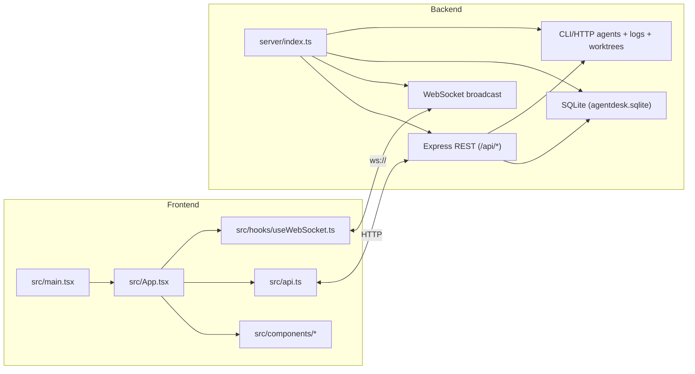
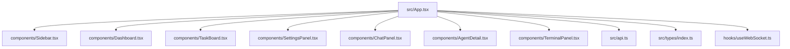
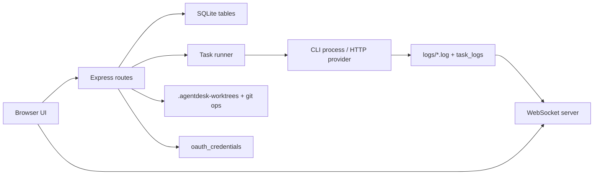
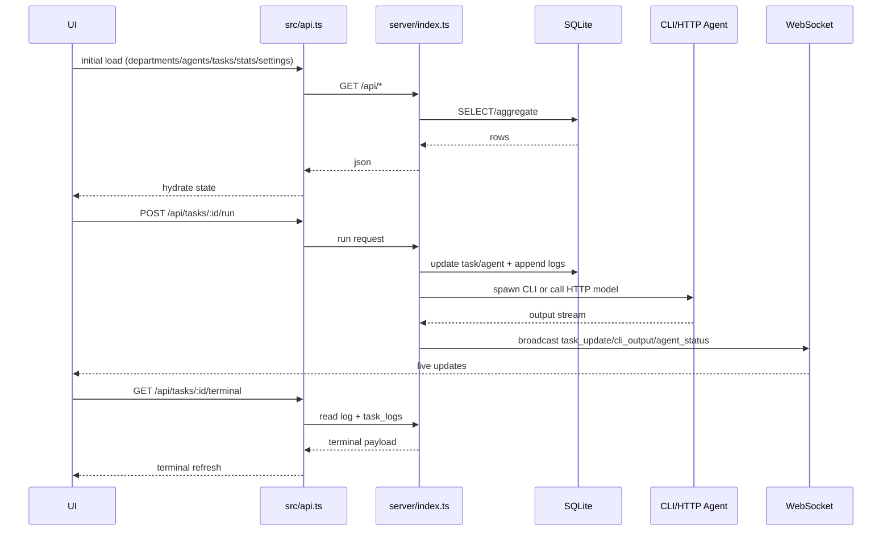
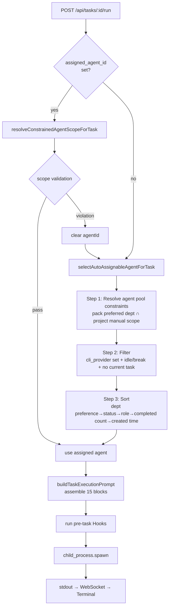
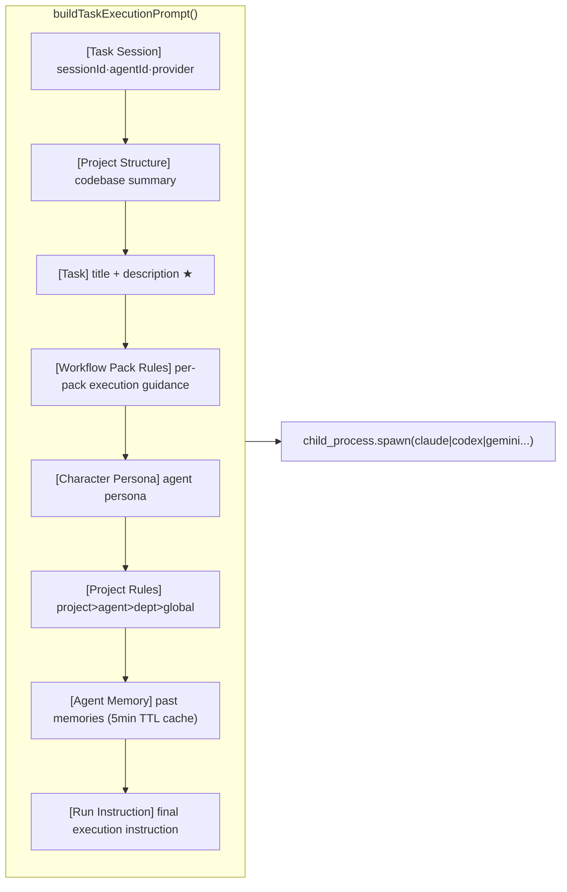
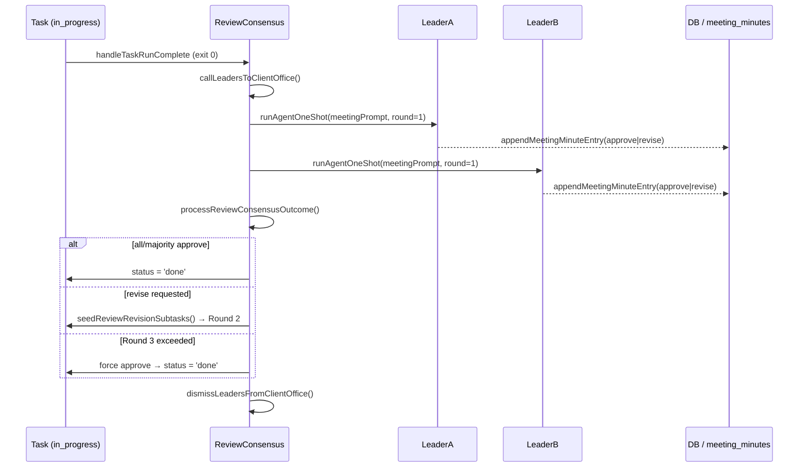
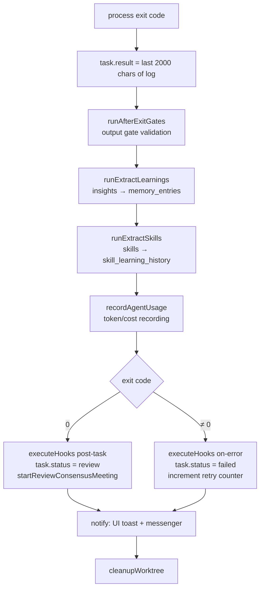

# System Structure Map

Generated from parallel architecture analysis lanes:
1. Frontend module map (`src/`)
2. Backend module map (`server/`)
3. Tooling/docs map (`scripts/`, `docs/`)
4. Build/config map (`package.json`, `tsconfig*`, `vite.config.ts`, `.env*`)
5. End-to-end runtime sequence (UI -> API -> DB/CLI -> WS -> UI)
6. Repository inventory (tree and key files)

## High-Level System Map



## Frontend Composition



## Backend Runtime Surface



## Core Runtime Sequence



## Key Files

- Runtime entry: `server/index.ts`, `src/main.tsx`, `src/App.tsx`
- API contract layer: `src/api.ts`
- Shared model types: `src/types/index.ts`
- Visualization generator: `scripts/generate-architecture-report.mjs`
- Generated artifacts: `docs/architecture/README.md`, `docs/architecture/*.mmd`, `docs/architecture/architecture.json`

## Refresh Commands

```bash
npm run arch:map
```

---

## Agent Selection & Task Assignment Flow



## Task Instruction Assembly (Prompt Blocks)



## Agent Meeting & Consensus Flow



## Outcome Pipeline



---

## 2.0 Data Model Additions (New Tables)

New DB tables added in the Project OS renewal (2.0). Existing `projects`, `agents`, and `departments` tables are retained; the tables below are added.

| Table | Purpose | Key Columns |
|-------|---------|-------------|
| `categories` | Project type definitions (categories) | `id`, `name`, `slug`, `description`, `icon`, `color`, `kpi_schema`, `risk_schema`, `gate_schema`, `deliverable_schema`, `is_template`, `version`, `owner_scope` |
| `category_versions` | Category version history | `id`, `category_id`, `version`, `snapshot_json`, `created_at` |
| `project_agents` | Project-agent team join table (junction) | `project_id`, `agent_id`, `added_at` |
| `project_objectives` | Project objectives | `id`, `project_id`, `title`, `description`, `status`, `order` |
| `project_risks` | Project risks | `id`, `project_id`, `title`, `severity`, `status`, `mitigation` |
| `project_gates` | Project review stages | `id`, `project_id`, `title`, `status`, `due_date`, `criteria` |
| `project_outputs` | Project planned deliverables (deliverable types) | `id`, `project_id`, `title`, `type`, `status`, `url` |

> **Note**: `project_outputs` are project-level planned deliverables (PRDs, API specs, etc.).
> Task execution result files use the existing `deliverables` / `task_reports` tables.

Columns added to the `projects` table:
- `category_id` — references `categories.id`
- `category_version` — category version pinned at creation time (for reproducibility)
- `success_metric` — JSON (overrides category `kpi_schema`)
- `risk_profile` — JSON
- `required_gates` — JSON array
- `deliverable_schema` — JSON

Detailed API: [specs/api.md §2.0 Categories & Project Teams](../specs/api.md)
Detailed UX: [design/UI-SCREENS.md](../design/UI-SCREENS.md)
