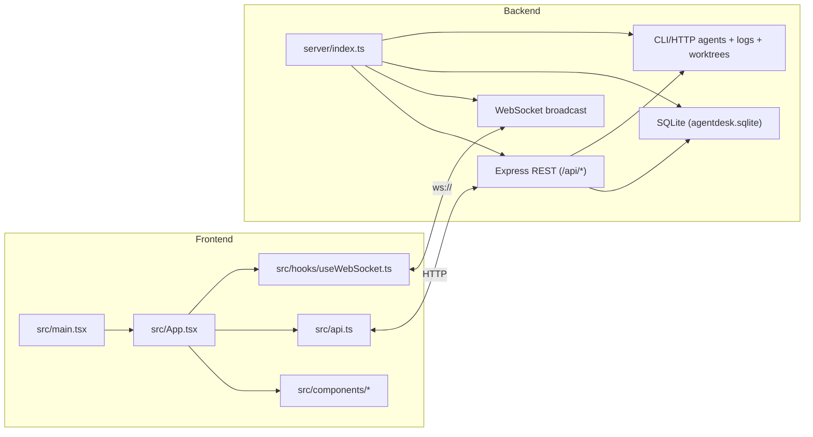
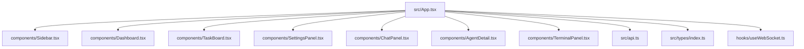
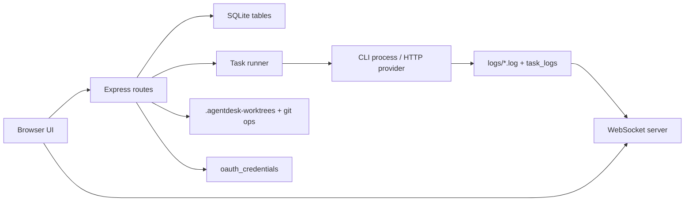
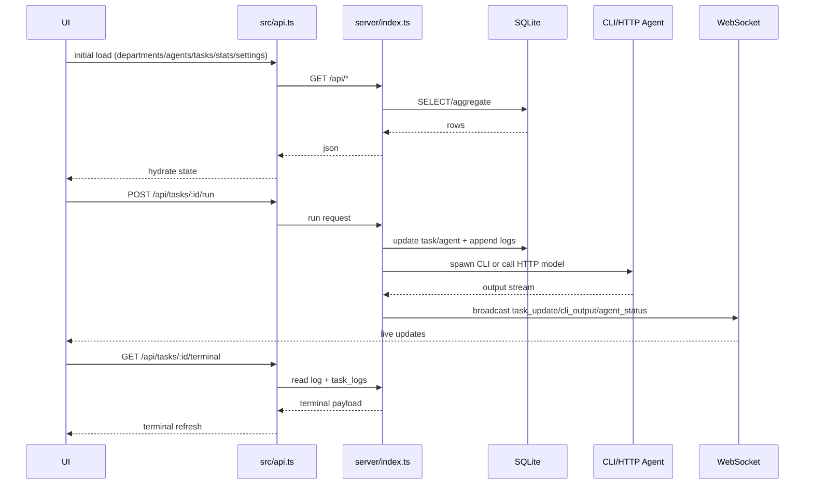
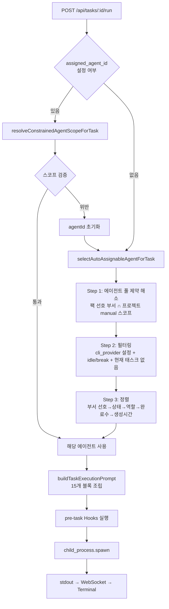
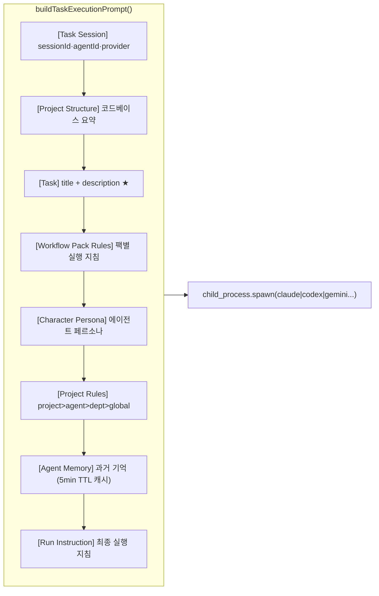
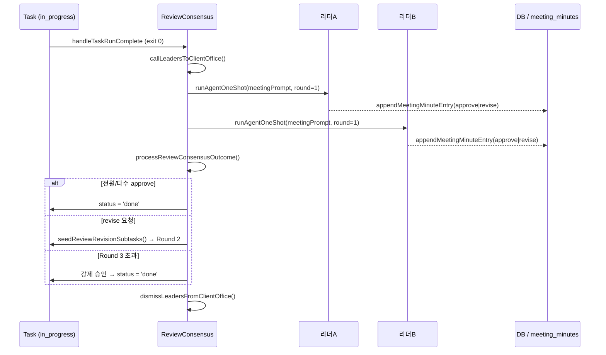
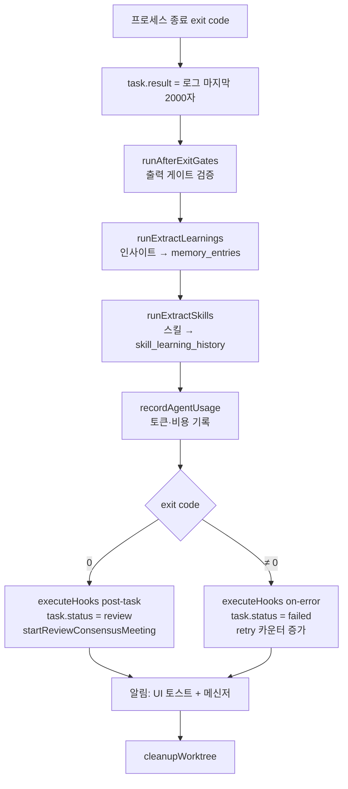

# System Structure Map

Generated from parallel architecture analysis lanes:
1. Frontend module map (`src/`)
2. Backend module map (`server/`)
3. Tooling/docs map (`scripts/`, `docs/`)
4. Build/config map (`package.json`, `tsconfig*`, `vite.config.ts`, `.env*`)
5. End-to-end runtime sequence (UI -> API -> DB/CLI -> WS -> UI)
6. Repository inventory (tree and key files)

## High-Level System Map



## Frontend Composition



## Backend Runtime Surface



## Core Runtime Sequence



## Key Files

- Runtime entry: `server/index.ts`, `src/main.tsx`, `src/App.tsx`
- API contract layer: `src/api.ts`
- Shared model types: `src/types/index.ts`
- Visualization generator: `scripts/generate-architecture-report.mjs`
- Generated artifacts: `docs/architecture/README.md`, `docs/architecture/*.mmd`, `docs/architecture/architecture.json`

## Refresh Commands

```bash
npm run arch:map
```

---

## 에이전트 선별 & 업무 지시 흐름



## 업무 지시서 조립 구조 (프롬프트 블록)



## 에이전트 회의 & 결과 도출 흐름



## 결과 도출 파이프라인



---

## 2.0 데이터 모델 추가 (신규 테이블)

Project OS 리뉴얼(2.0)에서 추가되는 DB 테이블 목록. 기존 `projects`, `agents`, `departments` 테이블은 유지하고 아래 테이블이 추가된다.

| 테이블 | 용도 | 주요 컬럼 |
|--------|------|-----------|
| `categories` | 프로젝트 유형 정의 (카테고리) | `id`, `name`, `slug`, `description`, `icon`, `color`, `kpi_schema`, `risk_schema`, `gate_schema`, `deliverable_schema`, `is_template`, `version`, `owner_scope` |
| `category_versions` | 카테고리 버전 이력 | `id`, `category_id`, `version`, `snapshot_json`, `created_at` |
| `project_agents` | 프로젝트-에이전트 팀 연결 (junction) | `project_id`, `agent_id`, `added_at` |
| `project_objectives` | 프로젝트 목표 | `id`, `project_id`, `title`, `description`, `status`, `order` |
| `project_risks` | 프로젝트 리스크 | `id`, `project_id`, `title`, `severity`, `status`, `mitigation` |
| `project_gates` | 프로젝트 검토 단계 | `id`, `project_id`, `title`, `status`, `due_date`, `criteria` |
| `project_outputs` | 프로젝트 계획 결과물 (산출물 타입) | `id`, `project_id`, `title`, `type`, `status`, `url` |

> **주의**: `project_outputs`는 프로젝트 레벨 계획 산출물(PRD, API 명세 등).
> 태스크 실행 결과 파일은 기존 `deliverables` / `task_reports` 테이블을 사용.

`projects` 테이블에 추가되는 컬럼:
- `category_id` — `categories.id` 참조
- `category_version` — 생성 시 카테고리 버전 고정 (재현성)
- `success_metric` — JSON (카테고리 `kpi_schema` 오버라이드)
- `risk_profile` — JSON
- `required_gates` — JSON 배열
- `deliverable_schema` — JSON

상세 API: [specs/api.md §2.0 카테고리 & 프로젝트 팀](../specs/api.md)
상세 UX: [design/UI-SCREENS.md](../design/UI-SCREENS.md)
