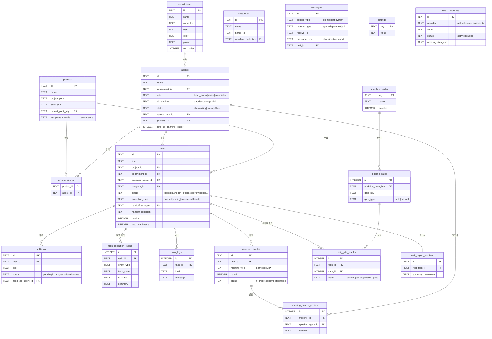

# AgentDesk — DB 스키마 ER 다이어그램

> SQLite (`better-sqlite3`), 타임스탬프는 Unix ms (`unixepoch()*1000`)
> 마이그레이션: `server/modules/bootstrap/schema/versioned-migrations.ts`
> 베이스 스키마: `server/modules/bootstrap/schema/base-schema.ts`

---

## 핵심 엔티티 관계도



---

## 테이블 그룹 요약

### 조직 구조
| 테이블 | 역할 |
|--------|------|
| `departments` | 팀/부서 (개발팀, 기획팀 등) |
| `agents` | AI 에이전트 (역할·CLI 제공자·상태) |
| `projects` | 프로젝트 (작업 경로, 목표) |
| `project_agents` | 프로젝트-에이전트 N:M 연결 |
| `categories` | 프로젝트 카테고리 (workflow_pack 매핑) |
| `workflow_packs` | 워크플로 패키지 정의 |

### 태스크 실행
| 테이블 | 역할 |
|--------|------|
| `tasks` | 태스크 (상태 머신: inbox → done) |
| `subtasks` | 서브태스크 (에이전트가 런타임 생성) |
| `task_execution_events` | 실행 상태 전환 이력 |
| `task_logs` | 실행 로그 |
| `task_interrupt_injections` | 실행 중 프롬프트 주입 (인터럽트) |
| `task_report_archives` | 완료 보고서 아카이브 |

### 미팅 & 협업
| 테이블 | 역할 |
|--------|------|
| `meeting_minutes` | 미팅 회의록 (planned/review) |
| `meeting_minute_entries` | 발언 내역 |
| `review_revision_history` | 검토 수정 요청 이력 |
| `messages` | 채팅 메시지 (에이전트↔클라이언트) |

### 파이프라인 게이트
| 테이블 | 역할 |
|--------|------|
| `pipeline_gates` | 워크플로별 품질 게이트 정의 |
| `task_gate_results` | 태스크별 게이트 통과 결과 |

### 인증 & 설정
| 테이블 | 역할 |
|--------|------|
| `settings` | KV 설정 저장소 (API 키, 언어 등) |
| `oauth_accounts` | OAuth 계정 (GitHub, Google 등) |
| `oauth_credentials` | OAuth 자격증명 (암호화 저장) |
| `oauth_states` | OAuth PKCE state 임시 저장 |

---

## 태스크 상태 머신

```
status (사용자 관점):
  inbox → planned → collaborating → in_progress → review → done
                                                         ↘ cancelled

execution_state (엔진 관점):
  queued → claiming → workspace_preparing → ready → running
         ↘ retry_backoff ↗              ↘ awaiting_review → succeeded
                                         ↘ blocked / stalled → recovering → running
                                         ↘ failed / cancelled
```

---

## 주요 인덱스

| 인덱스 | 목적 |
|--------|------|
| `idx_tasks_status` | 칸반 보드 상태별 조회 |
| `idx_tasks_agent` | 에이전트별 태스크 조회 |
| `idx_tasks_execution_state` | 실행 엔진 큐 폴링 |
| `idx_tasks_watchdog` | `(status, execution_state, last_heartbeat_at DESC)` — 이상 감지 (P3-5) |
| `idx_subtasks_task` | 태스크별 서브태스크 조회 |
