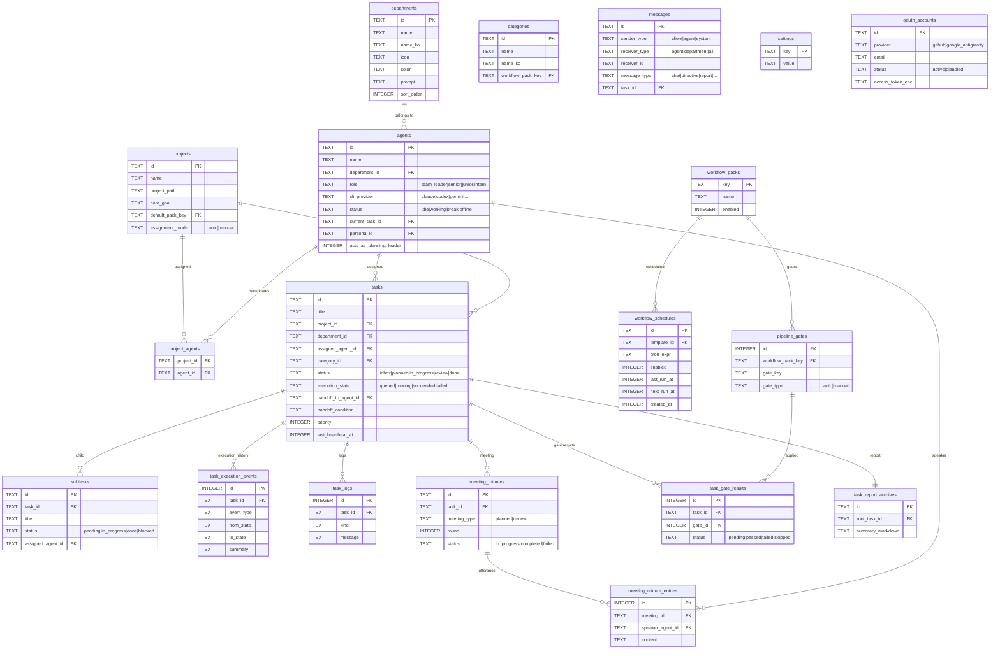

# AgentDesk — DB Schema ER Diagram

> SQLite (`better-sqlite3`), timestamps are Unix ms (`unixepoch()*1000`)
> Migrations: `server/modules/bootstrap/schema/versioned-migrations.ts`
> Base schema: `server/modules/bootstrap/schema/base-schema.ts`

---

## Core Entity Relationship Diagram



---

## Table Group Summary

### Organizational Structure
| Table | Role |
|-------|------|
| `departments` | Teams/departments (development, planning, etc.) |
| `agents` | AI agents (role, CLI provider, status) |
| `projects` | Projects (working path, goals) |
| `project_agents` | Project-agent N:M join table |
| `categories` | Project categories (workflow_pack mapping) |
| `workflow_packs` | Workflow package definitions |

### Task Execution
| Table | Role |
|-------|------|
| `tasks` | Tasks (state machine: inbox → done) |
| `subtasks` | Subtasks (created by agents at runtime) |
| `task_execution_events` | Execution state transition history |
| `task_logs` | Execution logs |
| `task_interrupt_injections` | Runtime prompt injections (interrupts) |
| `task_report_archives` | Completed report archives |

### Meetings & Collaboration
| Table | Role |
|-------|------|
| `meeting_minutes` | Meeting minutes (planned/review) |
| `meeting_minute_entries` | Utterance records |
| `review_revision_history` | Review revision request history |
| `messages` | Chat messages (agent ↔ client) |

### Pipeline Gates
| Table | Role |
|-------|------|
| `pipeline_gates` | Quality gate definitions per workflow |
| `task_gate_results` | Gate pass/fail results per task |

### Workflow Scheduling (v1.3.0)
| Table | Role |
|-------|------|
| `workflow_schedules` | Cron schedules per workflow template (migration `2026-03-17-001`) |

### Library (Agent Behavior Configuration)
| Table | Role | scope_type values |
|-------|------|-------------------|
| `hook_entries` | Pre/post-task scripts (event hooks) | global \| department \| agent \| workflow_pack \| **project** (migration `2026-03-23-001`) |
| `agent_rules` | Behavioral rules injected into prompts | global \| department \| agent \| project |
| `memory_entries` | Agent memory / context snippets | global \| department \| agent \| project (migration `2026-03-23-002`) |
| `agent_skills` | Learned skills (markdown) per agent/provider | — |
| `hook_learning_history` | Skill learning job records | — |

### Auth & Settings
| Table | Role |
|-------|------|
| `settings` | KV settings store (API keys, language, etc.) |
| `oauth_accounts` | OAuth accounts (GitHub, Google, etc.) |
| `oauth_credentials` | OAuth credentials (encrypted storage) |
| `oauth_states` | OAuth PKCE state temporary storage |

---

## Task State Machine

```
status (user perspective):
  inbox → planned → collaborating → in_progress → review → done
                                                        ↘ cancelled

execution_state (engine perspective):
  queued → claiming → workspace_preparing → ready → running
         ↘ retry_backoff ↗              ↘ awaiting_review → succeeded
                                         ↘ blocked / stalled → recovering → running
                                         ↘ failed / cancelled
```

---

## Key Indexes

| Index | Purpose |
|-------|---------|
| `idx_tasks_status` | Kanban board query by status |
| `idx_tasks_agent` | Query tasks by agent |
| `idx_tasks_execution_state` | Execution engine queue polling |
| `idx_tasks_watchdog` | `(status, execution_state, last_heartbeat_at DESC)` — anomaly detection (P3-5) |
| `idx_subtasks_task` | Query subtasks by task |
| `idx_workflow_schedules_next_run` | `(next_run_at)` — scheduler tick polling |
| `idx_workflow_schedules_template` | `(template_id)` — per-template list |
